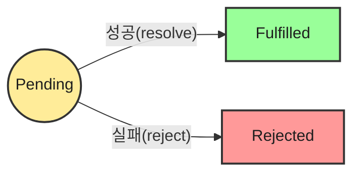

## 자바스크립트는 기다려주지 않는다

자바스크립트는 **싱글 스레드(Single Thread)** 기반의 언어다. 한 번에 하나의 작업만 처리할 수 있다는 뜻이다.
하지만 웹 환경에서는 서버에서 데이터를 받아오거나(Network), 파일을 읽는 등 시간이 오래 걸리는 작업이 필수적이다.
만약 이 작업들을 동기적으로 처리한다면, 데이터가 올 때까지 브라우저는 멈춰 버릴 것이다.

그래서 자바스크립트는 **비동기(Asynchronous)** 방식을 채택했다. 문제는 "언제 끝날지 모르는 작업"을 어떻게 관리하느냐다.
이 글은 그 관리 방법의 진화 과정인 **Callback → Promise → Async/Await**의 흐름을 정리한 글이다.

### 1. 과거의 방식: 콜백(Callback)과 그 한계
Promise가 등장하기 전(ES6 이전), 우리는 비동기 작업이 끝나면 실행할 함수(Callback)를 미리 넘겨주는 방식을 사용했다.

#### 1-1. 콜백 지옥 (Callback Hell)
작업이 하나라면 상관없지만, **"A 작업이 끝나면 B를 하고, B가 끝나면 C를 해라"** 같이 순서가 중요한 경우 문제가 발생한다.
함수 안에 함수가 계속 중첩되면서 코드가 오른쪽으로 계속 밀려나는 현상, 일명 **콜백 지옥**이 펼쳐진다.

```javascript
// 가독성이 최악인 콜백 지옥 예시
getData(function(a) {
    getMoreData(a, function(b) {
        getMoreData(b, function(c) {
            getMoreData(c, function(d) {
                console.log(d);
            });
        });
    });
});
```
이 방식은 **가독성**뿐만 아니라 <b>에러 처리(Error Handling)</b>도 매우 까다롭다. 각 콜백마다 `if (err)` 처리를 따로 해줘야 하기 때문이다.

### 2. 구세주의 등장: Promise
ES6(ECMAScript 2015)에서 도입된 **Promise**는 비동기 연산의 "최종 완료 또는 실패"를 나타내는 **객체**다.
콜백을 넘기는 대신, "내가 나중에 결과값을 주거나 실패 이유를 알려줄게!"라는 **약속(Promise) 객체**를 반환받는 방식이다.

#### 2-1. Promise의 3가지 상태 (States)
Promise는 생성된 순간부터 종료될 때까지 반드시 아래 3가지 상태 중 하나를 가진다.



| 상태 (State) | 설명 | 의미 |
| :--- | :--- | :--- |
| **Pending** (대기) | 비동기 처리가 아직 수행되지 않은 상태 | `new Promise()` 호출 시점 |
| **Fulfilled** (이행) | 비동기 처리가 성공적으로 완료된 상태 | `resolve()` 실행 시점 → `.then()` 실행 |
| **Rejected** (거부) | 비동기 처리가 실패하거나 오류가 발생한 상태 | `reject()` 실행 시점 → `.catch()` 실행 |

#### 2-2. 체이닝(Chaining)
Promise의 가장 큰 장점은 `.then()`을 꼬리에 꼬리를 무는 형태로 연결할 수 있다는 점이다.
콜백 지옥처럼 깊어지는 것이 아니라, **아래로 흐르는 직관적인 코드** 작성이 가능하다.

```javascript
getData()
  .then(result => getMoreData(result)) // 성공 시 실행
  .then(result2 => console.log(result2))
  .catch(error => console.error(error)); // 어디서든 에러가 나면 여기서 잡음
```

### 3. 완성형 문법: Async / Await
ES8(ES2017)에서는 Promise를 더 편하게 쓸 수 있는 <b>Syntactic Sugar(문법적 설탕)</b>인 `async/await`가 등장했다.
비동기 코드를 마치 <b>동기 코드(순서대로 실행되는 코드)</b>처럼 보이게 만들어 가독성을 극대화했다.

#### 3-1. 동작 원리
- **async**: 함수 앞에 붙이며, 이 함수는 항상 **Promise를 반환**하도록 강제된다.
- **await**: Promise 앞에 붙이며, **"이 비동기 작업이 끝날 때까지(성공/실패) 잠깐 기다려!"** 라는 뜻이다.

> **심화: Non-blocking**
> `await`가 기다린다고 해서 브라우저 전체가 멈추는 것(Blocking)은 아니다. 해당 `async` 함수 내부의 실행 컨텍스트만 일시 중지되고, 나머지 메인 스레드 작업은 정상적으로 돌아간다.

#### 3-2. Promise vs Async/Await 비교

<table>
    <caption>동일한 로직의 구현 방식 차이</caption>
    <thead>
        <tr>
            <th>구분</th>
            <th>Promise (.then)</th>
            <th>Async / Await</th>
        </tr>
    </thead>
    <tbody>
        <tr>
            <td><b>코드 스타일</b></td>
            <td>체이닝 방식 (<code>.then().then()</code>)</td>
            <td>동기 코드 방식 (<code>const a = await ...</code>)</td>
        </tr>
        <tr>
            <td><b>에러 처리</b></td>
            <td><code>.catch()</code> 메서드 사용</td>
            <td>일반적인 <code>try-catch</code> 문 사용</td>
        </tr>
        <tr>
            <td><b>가독성</b></td>
            <td>복잡한 분기 처리가 어려움</td>
            <td>조건문, 반복문 사용이 매우 자연스러움</td>
        </tr>
        <tr>
            <td><b>디버깅</b></td>
            <td>스택 트레이스 추적이 다소 어려움</td>
            <td>동기 코드처럼 명확하게 추적 가능</td>
        </tr>
    </tbody>
</table>

### 4. Async/Await 사용 시 주의사항 (Best Practices)
`await`는 마법처럼 편하지만, 잘못 쓰면 성능을 저하시키거나 에러를 놓칠 수 있다.

#### 4-1. 에러 핸들링은 필수 (try-catch)
Promise 체이닝의 `.catch()`와 달리, `await`만 쓰면 에러 발생 시 스크립트가 멈춰버릴 수 있다.
따라서 **반드시 `try-catch` 블록으로 감싸서** 에러를 안전하게 처리해야 한다.

```javascript
async function fetchData() {
  try {
    const response = await fetch('...');
    const data = await response.json();
  } catch (error) {
    console.error('데이터 가져오기 실패:', error);
  }
}
```

#### 4-2. 직렬 처리 vs 병렬 처리 (Waterfall 방지)
가장 많이 하는 실수가 서로 상관없는 비동기 작업들을 순차적으로 `await` 하는 것이다. 이를 **Waterfall 현상**이라고 한다.

<span class="text-red-400"><b>비효율적인 방식 (직렬)</b></span>
```javascript
// A가 끝나야 B가 시작됨 (총 시간: A + B)
const user = await getUser(); 
const posts = await getPosts(); 
```

<span class="text-green-500"><b>효율적인 방식 (병렬)</b></span>  
두 작업이 서로 의존성이 없다면 `Promise.all`을 사용하여 동시에 시작해야 한다.
```javascript
// A와 B가 동시에 시작됨 (총 시간: Max(A, B))
const [user, posts] = await Promise.all([getUser(), getPosts()]);
```

> **심화: Promise.all vs Promise.allSettled**  
> `Promise.all`은 배열 중 하나만 실패해도 전체가 에러로 처리(Fail-fast)된다.
> 만약 하나가 실패해도 나머지는 결과를 받고 싶다면 ES2020에 추가된 `Promise.allSettled`를 사용하는 것이 좋다.

---

<div class="flex items-center gap-2"><svg class="w-10 h-10 text-gray-800 dark:text-gray-200" fill="none" xmlns="http://www.w3.org/2000/svg" viewBox="0 0 24 24"><path d="M5 3H3v18h18V3H5zm0 2h14v14H5V5zm4 7H7v2h2v2h2v-2h2v-2h2v-2h2V8h-2v2h-2v2h-2v2H9v-2z" fill="currentColor"/></svg><span class="font-bold text-2xl">글 요약</span></div>

- **Promise**: 콜백 지옥을 해결하기 위해 등장한 객체로, 비동기 작업의 상태(대기, 성공, 실패)를 관리한다.
- **Async/Await**: Promise를 기반으로 한 문법적 설탕으로, 비동기 코드를 동기 코드처럼 읽기 쉽게 작성할 수 있게 해준다.
- **에러 처리**: `async/await` 사용 시에는 `try-catch` 문을 사용하여 명시적으로 에러를 잡아야 한다.
- **성능 최적화**: 서로 의존성이 없는 독립적인 비동기 작업들은 `await`를 연달아 쓰지 말고, `Promise.all`을 사용해 **병렬**로 처리하는 것이 성능상 훨씬 유리하다.