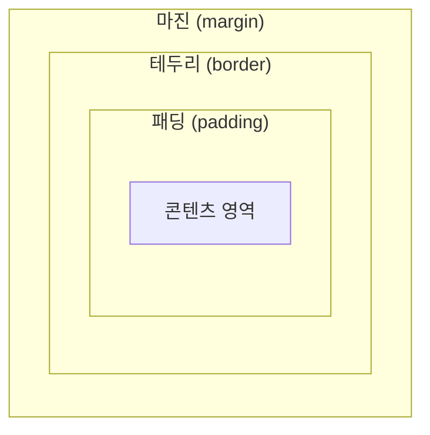

## CSS와 박스 모댈
CSS 박스 모델은 웹 문서의 내용을 <b>박스 형태</b>로 정의하는 방법이다. 이러한 박스 모델이 모여서
웹 문서를 구성하는 것이기 때문에 매우 중요한 개념이므로 반드시 익혀둘 필요가 있다.

### 블록 레벨 요소와 인라인 레벨 요소
박스 모델은 블록 레벨 요소인지 인라인 레벨 요소인지에 따라 나열 방법이 달라진다.

<b>블록 레벨(block-level) 요소</b>란 태그를 사용해서 요소를 삽입했을 때, 혼자 한 줄을 전부 자치하는 것을 말한다.  
한 줄을 모두 차지한다는 건 해당 요소의 너비가 100%라는 의미이다. 따라서 블록 레벨 요소의 왼쪽이나 오른쪽에는 다른 요소가 올 수 없다.

블록 레벨 요소의 예시로는 `
`, `
`, `<h1>` 태그 등이 있다.

<b>인라인 레벨(inline-level) 요소</b>는 한 줄 은 모두 차지 않는 요소이다. 영역을 컨텐츠만큼 차지하고 나머지 공간에 다른 요소가
올 수 있다. 따라서 한 줄에 인라인 레벨 요소를 여러 개 배치할 수도 있다.

인라인 레벨 요소의 예시로는 ``, ``, `<b>` 태그 등이 있다.

### 박스 모델의 기본 구성
블록 레벨 요소와 인라인 레벨 요소는 모두 <b>박스 형태</b>이다. 스타일 시트에서 박스 형태인 요소를 <b>박스 모델(box model) 요소</b>라고 한다.  
박스 모델은 <b>콘텐츠 영역</b>, 박스와 영역 사이의 여백인 <b>패딩(padding)</b>, 박스의 <b>테두리(border)</b> 그리고 여러 박스 모델 사이의 여백인
<b>마진(margin)</b> 등의 요소로 구성된다. 마진과 패딩은 웹 문서에서 다른 콘텐츠와의 사이 간격이나 배치 등을 고려할 때 필요한 개념이다.

패딩과 테두리, 마진은 상하좌우로 나뉘어 있어서 각 네 방향에 대한 스타일을 따로 설정할 수 있다. 단, 인라인 레벨 요소는 다른 웹 요소와 함께 표시되므로
마진과 패딩의 값이 정확하게 적용되지 않는다.

