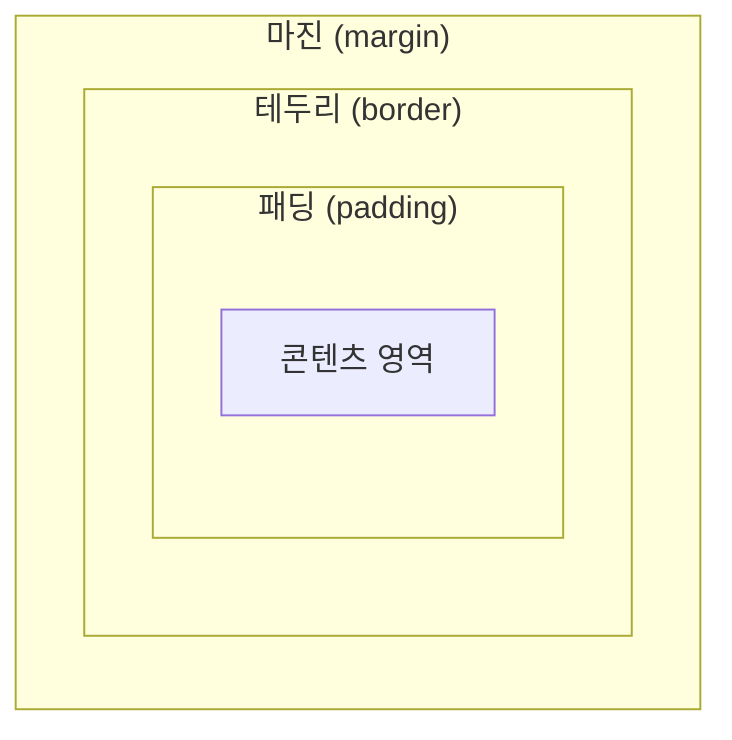

## CSS와 박스 모델
CSS 박스 모델은 웹 문서의 내용을 <b>박스 형태</b>로 정의하는 방법이다. 이러한 박스 모델이 모여서
웹 문서를 구성하는 것이기 때문에 매우 중요한 개념이므로 반드시 익혀둘 필요가 있다.

### 블록 레벨 요소와 인라인 레벨 요소
박스 모델은 블록 레벨 요소인지 인라인 레벨 요소인지에 따라 나열 방법이 달라진다.

<b>블록 레벨(block-level) 요소</b>란 태그를 사용해서 요소를 삽입했을 때, 혼자 한 줄을 전부 자치하는 것을 말한다.  
한 줄을 모두 차지한다는 건 해당 요소의 너비가 100%라는 의미이다. 따라서 블록 레벨 요소의 왼쪽이나 오른쪽에는 다른 요소가 올 수 없다.

블록 레벨 요소의 예시로는 `<div>`, `<p>`, `<h1>` 태그 등이 있다.

<b>인라인 레벨(inline-level) 요소</b>는 한 줄 은 모두 차지 않는 요소이다. 영역을 컨텐츠만큼 차지하고 나머지 공간에 다른 요소가
올 수 있다. 따라서 한 줄에 인라인 레벨 요소를 여러 개 배치할 수도 있다.

인라인 레벨 요소의 예시로는 `<span>`, ``, `<b>` 태그 등이 있다.

---

### 박스 모델의 기본 구성
블록 레벨 요소와 인라인 레벨 요소는 모두 <b>박스 형태</b>이다. 스타일 시트에서 박스 형태인 요소를 <b>박스 모델(box model) 요소</b>라고 한다.  
박스 모델은 <b>콘텐츠 영역</b>, 박스와 영역 사이의 여백인 <b>패딩(padding)</b>, 박스의 <b>테두리(border)</b> 그리고 여러 박스 모델 사이의 여백인
<b>마진(margin)</b> 등의 요소로 구성된다. 마진과 패딩은 웹 문서에서 다른 콘텐츠와의 사이 간격이나 배치 등을 고려할 때 필요한 개념이다.

패딩과 테두리, 마진은 상하좌우로 나뉘어 있어서 각 네 방향에 대한 스타일을 따로 설정할 수 있다. 단, 인라인 레벨 요소는 다른 웹 요소와 함께 표시되므로
마진과 패딩의 값이 정확하게 적용되지 않는다.



특정 요소의 CSS를 손쉽게 알아보고 싶다면, 마우스 우클릭 후 '검사'를 누르면 곧바로 해당 요소에 대한 스타일이 나온다.  
아래는 현재 글의 제목 태그에 대한 스타일링이다.
<figure>
     태그 박스 요소 스타일링 사진">
    <figcaption>margin(bottom)에 32가 들어간 걸 확인할 수 있다.</figcaption>
</figure>

### width,height
박스 모델에서 <b>콘텐츠 영역의 크기</b>를 지정할 때는 너비는 width, 높이는 height 속성을 사용하면 된다.
<table>
    <caption>width와 height 속성값</caption>
    <thead>
        <tr>
            <th>종류</th>
            <th>설명</th>
        </tr>
    </thead>
    <tbody>
        <tr>
            <td>&lt;크기&gt;</td>
            <td>너비나 높이의 값을 px이나 em 단위로 지정.</td>
        </tr>
        <tr>
            <td>&lt;백분율&gt;</td>
            <td>박스 모델을 포함하는 부모 요소를 기준으로 너빗값이나 높잇값을 백분율로 지정.</td>
        </tr>
        <tr>
            <td>auto</td>
            <td>박스 모델의 너빗값,높잇값을 콘텐츠 크기에 따라 자동을 결정. 기본값이다.</td>
        </tr>
    </tbody>
</table>

---

### box-sizing
width 속성과 height 속성은 박스 모델에서 콘텐츠 주변의 여백(마진)이나 테두리를 뺀 콘텐츠 영역의 크기를 설정한다.  
그래서 웹 문서에 여러 가지 요소를 배치할 때 실제 박스 모델이 차지하는 크기는 콘텐츠 영역 외에도 콘텐츠와 테두리 사이의 여백(패딩),
테두리 두께까지 신경써야 한다.

하지만 웹 문서에서 텍스트와 이미지 등의 다양한 요소를 배치할 때 매번 패딩과 테두리의 값을 계산해서 박스 모델의 크기를 넣어야 한다면
매우 불편할 것이다. 그럴 땐 `box-sizing` 속성을 사용하면 된다.

`box-sizing`은 박스 모델의 너비와 높이를 어떻게 결정할 것인지에 따라 `border-box`와 `content-box` 중에서 선택할 수 있다.

<table>
    <caption>box-sizing 속성값</caption>
    <thead>
        <tr>
            <th>종류</th>
            <th>설명</th>
        </tr>
    </thead>
    <tbody>
        <tr>
            <td><b>border-box</b></td>
            <td>패딩과 테두리를 <b>포함</b>해서 너빗값을 지정.</td>
        </tr>
        <tr>
            <td><b>border-content</b></td>
            <td>콘텐츠 영역인 너빗값을 지정. 기본값이다.</td>
        </tr>
    </tbody>
</table>

CSS에서 박스 모델을 사용하면서 요소의 크기를 쉽게 계산하려면 `box-sizing` 속성을 `border-box`로 설정해 놓으면 된다.

---

### box-shadow
CSS에서 `box-shadow` 속성을 사용하면 포토샵과 같은 프로그램을 따로 사용하지 않더라도 사진이나 박스에 그림자 효과를 줄 수 있다.  
`box-shadow`에서 그림자의 위치나 색상, 흐림 정도 등을 지정하려면 다음 형식으로 사용하면 된다.  

```CSS
p { box-shadow: <수평 거리> <수직 거리> <흐림 정도> <번짐 정도> <색상> inset } 
```

그림자 속성에선 수평 거리와 수직 거리는 반드시 지정해야 한다. 그 외의 속성값은 옵션이므로 필요할 때 능동적으로 사용하면 된다.

<table>
    <caption>box-shadow 속성값</caption>
    <thead>
        <tr>
            <th>종류</th>
            <th>설명</th>
        </tr>
    </thead>
    <tbody>
        <tr>
            <td><b>&lt;수평 거리&gt;</b></td>
            <td>그림자가 가로로 얼마나 떨어져 있는지 나타냄. 양숫값은 요소의 오른쪽, 음숫값은 요소의 왼쪽에 그림자를 만듦.</td>
        </tr>
        <tr>
            <td><b>&lt;수직 거리&gt;</b></td>
            <td>글미자가 세로로 얼마나 떨어져 있는지 나타냄. 양숫값은 요소의 아래쪽, 음숫값은 요소의 윗쪽에 그림자를 만듦.</td>
        </tr>
        <tr>
            <td><b>&lt;흐림 정도&gt;</b></td>
            <td>이 값을 생략하면 기본값으로 진한 그림자를 표시. 이값이 커질수록 부드러운 그림자를 표시하며 음숫값은 사용불가.</td>
        </tr>
        <tr>
            <td><b>&lt;번짐 정도&gt;</b></td>
            <td>양숫값을 사용하면 모든 방향으로 그림자가 퍼져서 박스보다 그림자가 크게 표시됨. 반대로 음숫값은 모든 방향으로 그림자가 축소되어 보임.</td>
        </tr>
        <tr>
            <td><b>&lt;색상&gt;</b></td>
            <td>한 가지만 지정할 수도 있고 공백으로 구분해서 색상을 여러 개 지정 가능. 기본값은 검은 색</td>
        </tr>
        <tr>
            <td><b>inset</b></td>
            <td>이 키워드를 함께 표시하면 그림자가 요소 안쪽으로 생성됨.</td>
        </tr>
    </tbody>
</table>

---

<div class="flex items-center gap-2"><svg class="w-10 h-10 text-gray-800" fill="none" xmlns="http://www.w3.org/2000/svg" viewBox="0 0 24 24"><path d="M5 3H3v18h18V3H5zm0 2h14v14H5V5zm4 7H7v2h2v2h2v-2h2v-2h2v-2h2V8h-2v2h-2v2h-2v2H9v-2z" fill="currentColor"/></svg><span class="font-bold text-2xl">글 요약</span></div>

- **블록 레벨 vs 인라인 레벨**
    - **블록 레벨**: 한 줄을 온전히 차지하여 너비가 100%인 요소. (`<div>`, `<p>` 등)
    - **인라인 레벨**: 콘텐츠 크기만큼만 영역을 차지하여 한 줄에 여러 요소를 배치할 수 있음. (`<span>`, `` 등)
- **박스 모델의 구성**: 실제 내용이 들어가는 **콘텐츠**, 내부 여백인 **패딩(padding)**, 경계선인 **테두리(border)**, 외부 여백인 **마진(margin)**으로 이루어짐.
- **`width` / `height`**: 콘텐츠 영역의 너비와 높이를 지정하는 속성. 고정 단위(px)나 가변 단위(%), 자동(auto) 값을 사용함.
- **`box-sizing`**: 박스의 크기 계산 기준을 결정하는 속성.
    - `content-box`: 기본값. 콘텐츠 영역만 크기로 계산함.
    - `border-box`: 테두리와 패딩까지 포함하여 전체 크기를 계산하므로 레이아웃 배치 시 계산이 편리함.
- **`box-shadow`**: 요소에 그림자 효과를 부여함. 수평·수직 거리는 필수이며, 흐림·번짐 정도와 색상, 안쪽 그림자(inset) 등을 옵션으로 설정 가능함.