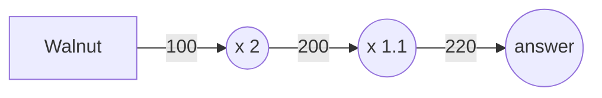
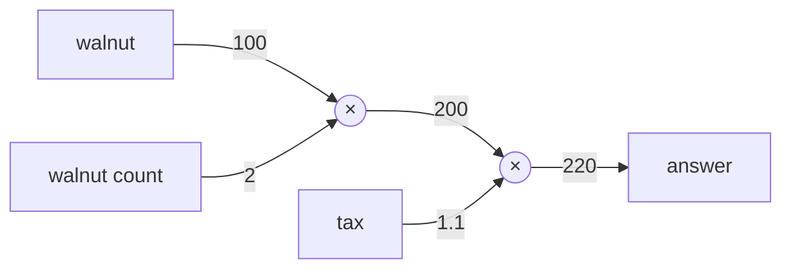
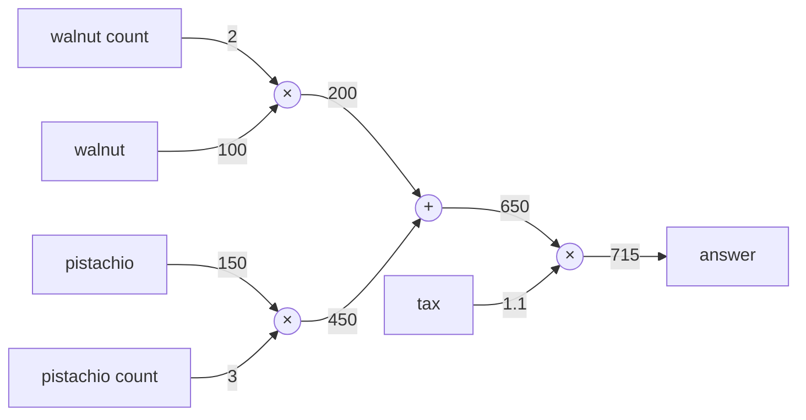
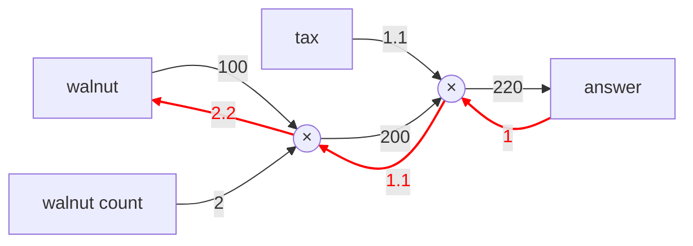
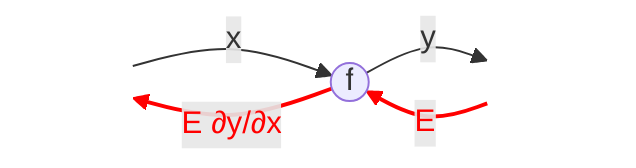

## 오차역전법
앞 학습에서 신경망의 가중치 매개변수의 기울기(가중치 매개변수에 대한 손실 함수의 기울기)를 수치 미분을 통해서 구했다. <b>수치 미분은 단순하고 구현하기 쉬우나 계산 시간이 오래 걸린다는 게 단점</b>이다. 하지만 <b>오차역전법</b>을 사용하면 가중치 매개변수의 기울기를 효율적으로 계산할 수 있다.

### 계산 그래프
계산 그래프는 계산 과정을 표현한 그래프이다. 그래프는 컴퓨터 자료구조의 그래프로 여러 <b>node</b>와 <b>edge</b>로 구성된다. 계산을 그래프로 한다는 말은 뭔가 어색하다. 구체적으로 어떻게 하는 건지 실제 예시를 통해 알아보자.

> 문제 예시: 경석이는 슈퍼에서 1개에 100원인 호두를 2개 구매했다. 소비세 10%를 부과한 지불 금액은?

계산 그래프는 계산 과정을 노드와 화살표로 표현한다. 위 문제를 계산 그래프로 풀면 아래와 같을 것이다.

위 플로우 차트처럼 처음에 호두의 100원이 $x 2$ 노드로 흐르고, 200원이 된 후 다음 노드에 전달된다.
200원은 $x1.1$ 노드를 거쳐 220원이 되고 이게 최종 정답이다.

위 차트에선 $x2$와 $x1.1$을 각각 하나의 연산으로 취급했지만, 곱셉인 $x$만을 연산으로 생각할 수도 있다.

그렇게 되면 아래처럼 $2$와 $1.1$은 각각 '사과의 개수'와 '소비세' 변수가 되어 원 밖에 표기된다.

좀 더 복잡한 문제에 대해서 시도를 해보자.

> 문제 예시: 경석이는 호두를 2개, 피스타치오를 3개 구매했다. 호두는 1개에 100원, 피스타치오는 1개에 150원이다. 소비세 10%를 포함한 지불금액은?

이 문제에선 덧셈 노드인 $'+'$가 새로 등장해 호두와 피스타치오의 금액을 합산한다. <b>계산 그래프는 왼쪽에서 오른쪽</b>으로 계산한다. 

지금까지 살펴본 것처럼 계산 그래프를 이용한 문제풀이는 아래의 흐름으로 진행한다.

1. 계산 그래프를 구성한다.
2. 그래프에서 계산은 왼쪽에서 오른쪽으로 진행한다.

이 2단계에서 왼쪽에서 오른쪽으로 진행하는 단계를 <b>순전파(forward propagation)</b>라고 한다.  
순전파는 계산 그래프의 출발점부터 종착점으로의 전파이다. 순전파의 반대, 즉 오른쪽에서 왼쪽으로의 전파는 <b>역전파(backward propagation)</b>라고 한다. 역전파는 미분을 계산할 때 중요한 역할을 한다.

#### 국소적 계산
계산 그래프의 특징은 '국소적 계산'을 전파함으로써 최종 결과를 얻는다는 점에 있다. 국소적이란 '자신과 <b>직접 관계된</b> 작은 범위'라는 의미다. 따라서 국소적 계산은 전체에서 어떤 일이 벌어지든 상관없이 자신과 직접 관계된 정보만을 결과로 출력한다.

예를 들어 복잡한 계산 결과와 호두 2개인 200원을 거기에 더하는 그래프를 상상해보자. 복잡한 계산의 결과가 얼마가 됐던 '덧셈 노드'는 그냥 두 숫자(a + 200)를 더할 뿐이다.

이처럼 계산 그래프는 국소적 계산에 집중한다. 전체 계산이 아무리 복잡해도 각 노드는 자신과 직접 관계를 맺는 노드와 국소적으로 계산할 뿐이다. 국소적 계산은 단순하나 그 결과를 전달함에 있어 전체를 구성하는 복잡한 계산이 수행된다.

#### 왜 계산 그래프를 쓰는가
지금까지 살펴본 계산 그래프 예시로 이점을 알 수 있다. 하나는 '국소적 계산'이다. 전체 연산이 아무리 복잡해도 각 노드 입장에선 국소적인 연산만을 수행해 문제를 단순화시킨다.

또 다른 이점은 <b>계산 그래프는 중간 계산 결과를 모두 보관</b>할 수 있다는 점이다. 앞서 보여준 그림처럼 중간 계산값($200, 650, 715$)을 전부 알 수 있었다.

하지만 이 정도로는 계산 그래프 이점이 와닿지만은 않는다. 가장 큰 이유는 역전파를 통해 미분을 효율적으로 계산할 수 있다는 점에 있다.

계산 그래프의 역전파를 설명하기 위해서 1번 문제를 다시 살펴보자. 1번 문제는 호두를 2개사서 소비세를 포함한 최종 금액을 구하는 것이었다. 

여기서 호두 가격이 오르면 최종 금액에 어떤 영향을 미치는지 알고 싶다고 해보자. 이는 <b>'호두 가격에 대한 지불 금액의 미분'</b>을 구하는 문제에 해당한다.

수식으로 표현하면 호두를 $x$, 지불 금액을 $L$이라 했을 때 $\frac{\partial L}{\partial x}$을 구하는 것이다.
이 미분값은 호두 값이 '정말 미세하게' 상승했을 때의 최종 지불 금액 증가량을 나타낸다.

앞에서 말했듯이 미분은 그래프에서 역전파를 통해 구할 수 있다. 결과만 보면 아래의 그림처럼 나타낼 수 있다.

위 그림처럼 역전파는 순전파와 반대 방향의 화살표로 그렸다. 이 전파는 '국소적 미분'을 전달하고 그 미분 값은 화살표의 아래에 적었다. 이 예시는 $1 -> 1.1 -> 2.2$순으로 미분 값을 전달한다.

 이 결과로부터 '호두 가격에 대한 지불 금액의 미분'은 2.2라는 걸 알 수 있다. 호두가 1원 오르면 최종 금액은 2.2원 오르는 것이다. (정말 미세하게 오른 $h$값에 $2.2h$만큼 상승)

 여기선 호두 가격에 대한 미분만 구했으나, '소비세에 대한 지불 금액의 미분' 혹은 '호두 개수에 대한 지불 금액의 미분'도 똑같이 구할 수 있다. 그리고 그때는 중간까지 구한 미분 결과를 공유해서 다수의 미분을 효율적으로 계산할 수 있다.

 이처럼 계산 그래프의 이점은 순전파와 역전파를 활용해 각 변수의 미분을 효율적으로 구할 수 있다는 것이다.

### 연쇄 법칙
순전파는 왼쪽에서 오른쪽으로 계산 결과를 전달했고, 역전파는 그 반대로 오른쪽에서 왼쪽으로 전달했다.

또한, 이 '국소적 미분'을 전달하는 원리는 연쇄법칙에 따른 것이다. 연쇄 법칙은 무엇이고 그것이 계산 그래프 상에서 역전파와 같다는 사실을 알아보자.

#### 계산 그래프의 역전파
$y=f(x)$라는 계산의 역전파를 생각해보자. 

위 그림과 같이 신호 $E$에 노드의 국소적 미분($\frac{\partial y}{\partial x}$)을 곱한 후 다음 노드로 전달하여 역전파를 계산한다. 여기서 국소적 미분은 순전파의 $y=f(x)$ 계산의 미분을 구한다는 의미이며, 이는 $x$에 대한 $y$의 미분($\frac{\partial y}{\partial x}$)을 구한다는 뜻이다.

그리고 이 국소적인 미분을 상류에서 전달된 값(여기선 $E$)에 곱해 안쪽 노드로 전달하는 것이다.

이게 역전파의 계산 순서인데, 이러한 방식에 따르면 목표로 하는 미분 값을 효율적으로 구할 수 있다는 점이 이 전파의 핵심이다. 그리고 이는 연쇄법칙의 원리로 설명이 가능하다.

#### 연쇄법칙이란?
연쇄법칙을 설명하기 위해선, 합성 함수에 대한 이야기를 해야 한다.

함성 함수란 여러 함수로 구성된 함수이다. 예를 들어 $z = (x+y)^2$와 같이 $z = t^2$과 $t = x+y$로 2개 이상의 함수로 구성된 함수를 말한다.

<b>연쇄법칙은 함성 함수의 미분에 대한 성질이며 합성 함수의 미분은 합성 함수를 구성하는 각 함수의 미분 곱으로 나타낼 수 있다</b>.

