## 오차역전법
앞 학습에서 신경망의 가중치 매개변수의 기울기(가중치 매개변수에 대한 손실 함수의 기울기)를 수치 미분을 통해서 구했다. <b>수치 미분은 단순하고 구현하기 쉬우나 계산 시간이 오래 걸린다는 게 단점</b>이다. 하지만 <b>오차역전법</b>을 사용하면 가중치 매개변수의 기울기를 효율적으로 계산할 수 있다.

### 계산 그래프
계산 그래프는 계산 과정을 표현한 그래프이다. 그래프는 컴퓨터 자료구조의 그래프로 여러 <b>node</b>와 <b>edge</b>로 구성된다. 계산을 그래프로 한다는 말은 뭔가 어색하다. 구체적으로 어떻게 하는 건지 실제 예시를 통해 알아보자.

> 문제 예시: 경석이는 슈퍼에서 1개에 100원인 호두를 2개 구매했다. 소비세 10%를 부과한 지불 금액은?

계산 그래프는 계산 과정을 노드와 화살표로 표현한다. 위 문제를 계산 그래프로 풀면 아래와 같을 것이다.

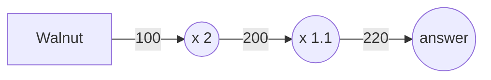
위 플로우 차트처럼 처음에 호두의 100원이 $x 2$ 노드로 흐르고, 200원이 된 후 다음 노드에 전달된다.
200원은 $x1.1$ 노드를 거쳐 220원이 되고 이게 최종 정답이다.

위 차트에선 $x2$와 $x1.1$을 각각 하나의 연산으로 취급했지만, 곱셉인 $x$만을 연산으로 생각할 수도 있다.

그렇게 되면 아래처럼 $2$와 $1.1$은 각각 '사과의 개수'와 '소비세' 변수가 되어 원 밖에 표기된다.

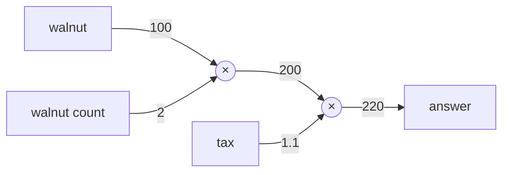

좀 더 복잡한 문제에 대해서 시도를 해보자.

> 문제 예시: 경석이는 호두를 2개, 피스타치오를 3개 구매했다. 호두는 1개에 100원, 피스타치오는 1개에 150원이다. 소비세 10%를 포함한 지불금액은?

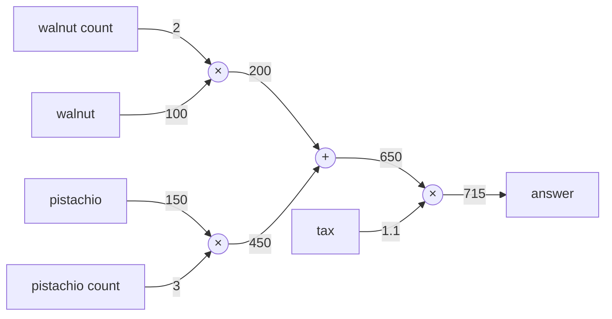

이 문제에선 덧셈 노드인 $'+'$가 새로 등장해 호두와 피스타치오의 금액을 합산한다. <b>계산 그래프는 왼쪽에서 오른쪽</b>으로 계산한다. 

지금까지 살펴본 것처럼 계산 그래프를 이용한 문제풀이는 아래의 흐름으로 진행한다.

1. 계산 그래프를 구성한다.
2. 그래프에서 계산은 왼쪽에서 오른쪽으로 진행한다.

이 2단계에서 왼쪽에서 오른쪽으로 진행하는 단계를 <b>순전파(forward propagation)</b>라고 한다.  
순전파는 계산 그래프의 출발점부터 종착점으로의 전파이다. 순전파의 반대, 즉 오른쪽에서 왼쪽으로의 전파는 <b>역전파(backward propagation)</b>라고 한다. 역전파는 미분을 계산할 때 중요한 역할을 한다.

#### 국소적 계산
계산 그래프의 특징은 '국소적 계산'을 전파함으로써 최종 결과를 얻는다는 점에 있다. 국소적이란 '자신과 <b>직접 관계된</b> 작은 범위'라는 의미다. 따라서 국소적 계산은 전체에서 어떤 일이 벌어지든 상관없이 자신과 직접 관계된 정보만을 결과로 출력한다.

예를 들어 복잡한 계산 결과와 호두 2개인 200원을 거기에 더하는 그래프를 상상해보자. 복잡한 계산의 결과가 얼마가 됐던 '덧셈 노드'는 그냥 두 숫자(a + 200)를 더할 뿐이다.

이처럼 계산 그래프는 국소적 계산에 집중한다. 전체 계산이 아무리 복잡해도 각 노드는 자신과 직접 관계를 맺는 노드와 국소적으로 계산할 뿐이다. 국소적 계산은 단순하나 그 결과를 전달함에 있어 전체를 구성하는 복잡한 계산이 수행된다.

#### 왜 계산 그래프를 쓰는가
지금까지 살펴본 계산 그래프 예시로 이점을 알 수 있다. 하나는 '국소적 계산'이다. 전체 연산이 아무리 복잡해도 각 노드 입장에선 국소적인 연산만을 수행해 문제를 단순화시킨다.

또 다른 이점은 <b>계산 그래프는 중간 계산 결과를 모두 보관</b>할 수 있다는 점이다. 앞서 보여준 그림처럼 중간 계산값($200, 650, 715$)을 전부 알 수 있었다.

하지만 이 정도로는 계산 그래프 이점이 와닿지만은 않는다. 가장 큰 이유는 역전파를 통해 미분을 효율적으로 계산할 수 있다는 점에 있다.

계산 그래프의 역전파를 설명하기 위해서 1번 문제를 다시 살펴보자. 1번 문제는 호두를 2개사서 소비세를 포함한 최종 금액을 구하는 것이었다. 

여기서 호두 가격이 오르면 최종 금액에 어떤 영향을 미치는지 알고 싶다고 해보자. 이는 <b>'호두 가격에 대한 지불 금액의 미분'</b>을 구하는 문제에 해당한다.

수식으로 표현하면 호두를 $x$, 지불 금액을 $L$이라 했을 때 $\frac{\partial L}{\partial x}$을 구하는 것이다.
이 미분값은 호두 값이 '정말 미세하게' 상승했을 때의 최종 지불 금액 증가량을 나타낸다.

앞에서 말했듯이 미분은 그래프에서 역전파를 통해 구할 수 있다. 결과만 보면 아래의 그림처럼 나타낼 수 있다.

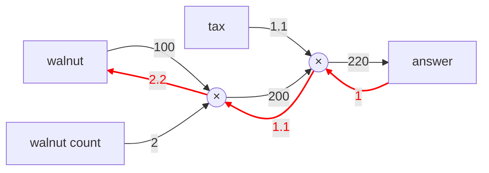

위 그림처럼 역전파는 순전파와 반대 방향의 화살표로 그렸다. 이 전파는 '국소적 미분'을 전달하고 그 미분 값은 화살표의 아래에 적었다. 이 예시는 $1 -> 1.1 -> 2.2$순으로 미분 값을 전달한다.

 이 결과로부터 '호두 가격에 대한 지불 금액의 미분'은 2.2라는 걸 알 수 있다. 호두가 1원 오르면 최종 금액은 2.2원 오르는 것이다. (정말 미세하게 오른 $h$값에 $2.2h$만큼 상승)

 여기선 호두 가격에 대한 미분만 구했으나, '소비세에 대한 지불 금액의 미분' 혹은 '호두 개수에 대한 지불 금액의 미분'도 똑같이 구할 수 있다. 그리고 그때는 중간까지 구한 미분 결과를 공유해서 다수의 미분을 효율적으로 계산할 수 있다.

 이처럼 계산 그래프의 이점은 순전파와 역전파를 활용해 각 변수의 미분을 효율적으로 구할 수 있다는 것이다.

### 연쇄 법칙
순전파는 왼쪽에서 오른쪽으로 계산 결과를 전달했고, 역전파는 그 반대로 오른쪽에서 왼쪽으로 전달했다.

또한, 이 '국소적 미분'을 전달하는 원리는 연쇄법칙에 따른 것이다. 연쇄 법칙은 무엇이고 그것이 계산 그래프 상에서 역전파와 같다는 사실을 알아보자.

#### 계산 그래프의 역전파
$y=f(x)$라는 계산의 역전파를 생각해보자. 
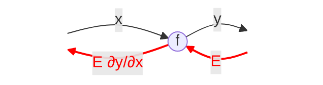
위 그림과 같이 신호 $E$에 노드의 국소적 미분($\frac{\partial y}{\partial x}$)을 곱한 후 다음 노드로 전달하여 역전파를 계산한다. 여기서 국소적 미분은 순전파의 $y=f(x)$ 계산의 미분을 구한다는 의미이며, 이는 $x$에 대한 $y$의 미분($\frac{\partial y}{\partial x}$)을 구한다는 뜻이다.

그리고 이 국소적인 미분을 상류에서 전달된 값(여기선 $E$)에 곱해 안쪽 노드로 전달하는 것이다.

이게 역전파의 계산 순서인데, 이러한 방식에 따르면 목표로 하는 미분 값을 효율적으로 구할 수 있다는 점이 이 전파의 핵심이다. 그리고 이는 연쇄법칙의 원리로 설명이 가능하다.

#### 연쇄법칙이란?
연쇄법칙을 설명하기 위해선, 합성 함수에 대한 이야기를 해야 한다.

함성 함수란 여러 함수로 구성된 함수이다. 예를 들어 $z = (x+y)^2$와 같이 $z = t^2$과 $t = x+y$로 2개 이상의 함수로 구성된 함수를 말한다.

<b>연쇄법칙은 함성 함수의 미분에 대한 성질이며 합성 함수의 미분은 합성 함수를 구성하는 각 함수의 미분 곱으로 나타낼 수 있다</b>.

위 식을 예로 설명하면 $\frac{\partial z}{\partial x}$($x$에 대한 $z$의 미분)은 $\frac{\partial z}{\partial t}$($t$에 대한 $z$의 미분)과 $\frac{\partial t}{\partial x}$($x$에 대한 $t$의 미분)의 곱으로 나타낼 수 있다는 것이다.

수식적으로는 아래와 같다.

$$
\frac{\partial z}{\partial x} = \frac{\partial z}{\partial t}\frac{\partial t}{\partial x}
$$

위 식은 약분에 의해서 $\partial t$를 지울 수 있다.  
합성함수의 미분을 이용해서 먼저 $\frac{\partial z}{\partial t}$과 $\frac{\partial t}{\partial x}$을 구하면 된다. (각각의 편미분)
$$

\frac{\partial t}{\partial x} = 1 \\
\frac{\partial z}{\partial t} = 2t
$$

따라서 $\frac{\partial z}{\partial x}$는 이 두 미분에 대한 곱이다.
$$
\frac{\partial z}{\partial x} = \frac{\partial z}{\partial t}\frac{\partial t}{\partial x} = 2t * 1 = 2(x+y)
$$

#### 연쇄법칙과 계산 그래프
위 식을 계산 그래프로 나타내보자. 2제곱 계산을 $**2$ 노드로 표현하면 아래의 그림처럼 된다.
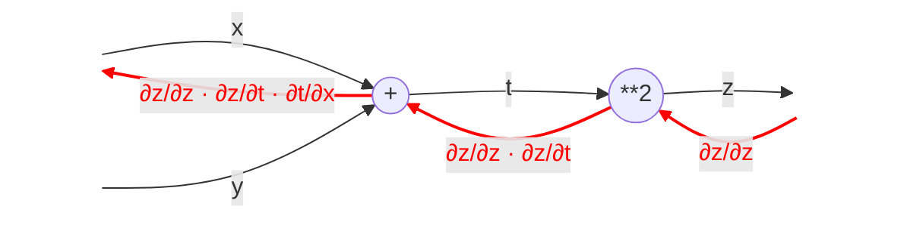

중요한 건 순전파와는 반대 방향으로 국소적 미분을 곱하면서 전달한다는 것이다.  
$y = f(x)$의 국소적 미분이 $\frac{\partial y}{\partial x}$인 것처럼 각 함수 $t = x +y$와 $z = t^2$에 대한 미분이 서로 곱한 것이다.

$z$의 경우에는 출력층이므로 미분할 경우 $\frac{\partial z}{\partial z}$가 된다.

결국 중요한 건 맨 왼쪽 역전파의 결과이다. $\frac{\partial z}{\partial z}\frac{\partial z}{\partial t}\frac{\partial t}{\partial x} = \frac{\partial z}{\partial x}$가 성립되어 $x$에 대한 $z$의 미분인 것은 변치 않는다.

즉, <b>역전파가 하는 일은 연쇄법칙의 원리와 동일하다</b>.

### 역전파
앞에서 계산 그래프의 역전파가 연쇄법칙에 따라 진행되는 모습을 알아보았다. 이번에는
$+$와 $×$ 연산에 따른 예시로 역전파 구조를 알아보자.

#### 덧셈 노드의 역전파
$z = x + y$라는 식을 예시로 역전파가 어떻게 진행되는지 보자.
먼저 $z = x + y$의 $x$와 $y$에 대한 각각의 편미분으로 아래와 같이 표현 가능하다.
$$
\frac{\partial z}{\partial x} = 1 \\
\frac{\partial z}{\partial y} = 1
$$

둘 다 지수가 1이기 때문에 미분 시, 모두 1이 된다. 계산 그래프로는 아래와 같다.

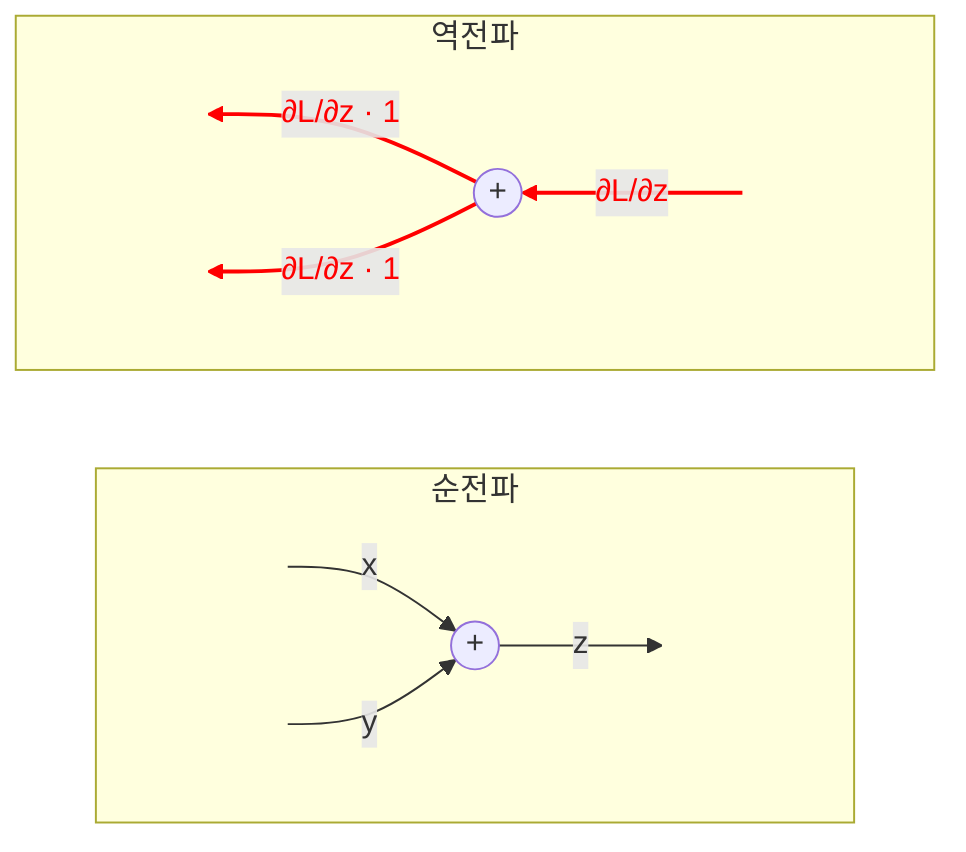

위 그림에서 역전파는 상류에서 전해진 미분($\frac{\partial L}{\partial z}$)에 1을 곱해 하류로 보낸다. 덧셈 노드의 역전파는 1을 곱할 뿐(국소적 계산) 입력된 값을 다음 노드로 전달한다.

여기서 상류에서 전해진 미분을 $\frac{\partial L}{\partial z}$라고 했는데, 이는 이 계산 그래프가 더 거대한 구조라서 $z$가 출력층이 아닌 하나의 중간 노드라고 생각할 경우 최종적으로 $L$이라는 값을 출력하는 계산 그래프라는 가정을 한 것이다.

따라서 $z$도 하나의 중간 노드일 뿐이고, $\frac{\partial L}{\partial z}$을 상류로부터 전달 받았고 이를 하류에 각각 $\frac{\partial L}{\partial x}$와 $\frac{\partial L}{\partial y}$로 전달한다.

결론적으로 덧셈 노드의 역전파에선 입력 신호(상류의 미분값)를 그냥 그대로 다음 노드로 전달하면 된다.

#### 곱셈 노드의 역전파
$z = xy$라는 곱셈식에 대한 예시로 역전파를 알아보자. 이 식의 미분은 아래와 같다.
$$
\frac{\partial z}{\partial x} = y \\
\frac{\partial z}{\partial y} = x
$$
둘은 각각 $x,y$에 대한 편미분이며 합성함수의 미분에 따라 두 미분의 곱이 곧 $z$의 미분이 될 것이다. 이걸 계산 그래프로 그리면 아래와 같다.

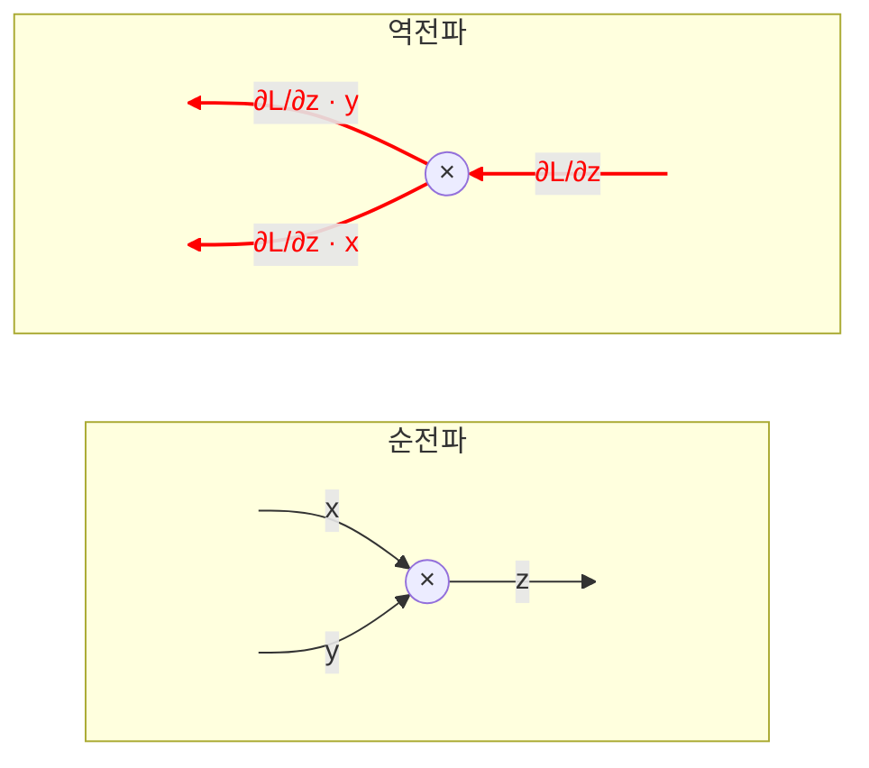

곱셈 노드의 역전파는 합성 함수의 미분에 따라서 $x$는 $x$에 대한 편미분인 $y × 1$을 $y$는 $y$애 대한 편미분인 $x × 1$을 상류에서 전달받은 미분값에 곱해서 전달시킨다. 즉, 서로 입력 신호를 바꿔서 하류로 전달한다.

이렇게 곱셈 노드의 역전파에선 덧셈 노드와는 다르게 순전파 입력 신호의 값이 필요하다. 그래서 곱셈 노드를 구현할 때는 순전파 입력 신호를 반드시 변수에 저장해야 한다.

#### 호두 쇼핑 예시
이전에 계산 그래프에 대한 설명으로 호두 구매에 대한 예시가 있었다.

이 문제에서는 호두의 가격, 호두의 개수, 소비세라는 세 변수가 최종 금액에 어떻게 영향을 주는지 알아내는 것이 목적이었다. 이는 곧 '호두 가격에 대한 지불 금액의 미분', '호두 개수에 대한 지불 금액의 미분', '소비세에 대한 지불 금액의 미분'을 구하는 것이다.

지금까지 설명한 바와 같이 곱셈 노드의 역전파에선 입력 신호를 서로 바꿔서 하류로 전달한다. 
그림의 결과를 보면 호두 가격의 미분은 2.2, 호두 개수의 미분은 110, 소비세의 미분은 200이다.

이는 소비세와 호두 가격이 같은 양만큼 오르면 최종 금액에는 소비세가 200의 크기로, 호두 가격이 2.2 크기로 영향을 준다고 해석할 수 있다. 단, 소비세와 사과 가격은 '단위'가 다르니 주의하자.

### 단순한 계층 구현하기

이번 절에서는 지금까지 보아온 지금까진 본 '호두 쇼핑'을 python으로 구현해본다. 여기서 계산 그래프의 곱셈 노드는 `MulLayer`, 덧셈 노드를 `AddLayer`라는 이름으로 구현한다.

#### 곱셈 계층
모든 계층은 `forward()`와 `backward()`라는 함수를 갖도록 인터페이스를 기반으로 구현할 것이다.  
이름 그대로 `forward()`는 순전파, `backward()`는 역전파를 처리한다.

```python
class MulLayer:
    def __init__(self):
        self.x = None
        self.y = None
    
    def forward(self, x, y):
        self.x = x
        self.y = y
        out = x + y

        return out
    
    def backward(self, dout):
        dx = dout * self.y
        dy = dout * self.x

        return dx,dy
```

생성자인 `__init()__`에선 인스턴스 변수인 $x,y$를 초기화한다. `forward()`에선 $x,y$를 파라미터로 받아 두 수를 곱한 걸 `return`하고, `backward()`에선 상류에서 넘어온 `dout`이라는 미분값에 순전파 파라미터를 서로 반대로 곱해 `return`하면 된다.

이 `MulLayer`를 사용해서 '호두 쇼핑'을 구현해보자. 호두 쇼핑의 계산 그래프는 앞에서 계속 봤던 그 그래프이다.


```python
walnut = 100
w_cnt = 2
tax = 1.1

mul_wal = MulLayer()
mul_tax = MulLayer()

# 순전파
wal_price = mul_wal.forward(walnut, w_cnt)
total = mul_tax.forward(wal_price, tax)

print(total) # 220
```

각 변수에 대한 미분은 `backward()`를 통해 구할 수 있다.

```python
# 역전파
dprice = 1
dwal_price, dtax = mul_tax.backward(dprice)
dwal,dw_cnt = mul_wal.backward(dwal_price)

print(dwal_price, dw_cnt, dtax) # 2.2 110 220
```

`backward()` 함수의 호출 순서는 `forward()`와는 정반대이며, 받는 파라미터 역시 '<b>순전파의 출력에 대한 미분</b>'임에 주의해야 한다.

#### 덧셈 계층
덧셈 노드 역시 아래와 같이 구현하면 된다.
```python
class AddLayer:
    def __init__(self):
        pass

    def forward(self,x,y):
        self.x = x
        self.y = y

        return x + y
    
    def backward(self,dout):
        dx = dout * 1
        dy = dout * 1

        return dx,dy
```

덧셈 계층에선 초기화가 필요없다. `backward()` 호출 시, 순전파의 값을 기록할 필요가 없기 때문이다. `forward()`에선 두 파라미터를 더하고, `backward()`에선 앞에서 전달받은 미분값을 그대로 
`return`하면 된다.

위 두 계층(덧셈,곱셈)을 활용해서 호두 2개와 피스타치오 3개를 구매하는 아래의 그래프를 코드로 구현해보자.


```python
walnut = 100
w_cnt = 3
pistachio = 150
p_cnt = 2
tax = 1.1

# 계층
mul_wal = MulLayer()
mul_pis = MulLayer()
mul_tax = MulLayer()
add_wal_pis = AddLayer()

# 순전파
wal_p = mul_wal.forward(walnut,w_cnt)
pis_p = mul_pis.forward(pistachio,p_cnt)
total = add_wal_pis.forward(wal_p,pis_p)
price = mul_tax.forward(total, tax)

# 역전파
dprice = 1
dtotal, dtax = mul_tax.backward(dprice)
dwalnut_price,dpistachio_price = add_wal_pis.backward(dtotal)
dwalnut,dw_cnt = mul_wal.backward(dwalnut_price)
dpistachio,dp_cnt = mul_pis.backward(dpistachio_price)

print(price) # 715
print(dwalnut,dpistachio,dw_cnt,dp_cnt,dtax) # 2.2 3.3 110 165 650
```

필요한 계층을 만들어 순전파를 먼저 호출하고 그 후에 역전파를 순전파의 반대 순서로 호출하면 원하는 값을 모두 구할 수 있다.  
이처럼 계산 그래프에서 계층은 쉽게 구현이 가능하며, 이를 통해 복잡한 미분도 쉽게 계산할 수 있다.

### 활성화 함수 계층 구현
계산 그래프를 이제 '신경망'에 도입해볼 차례다. 여기선 신경망을 구성하는 계층을 각각 하나의 클래스로 구현한다. 우선 활성화 함수인 ReLU와 Sigmoid 함수를 구현한다.

#### ReLU 계층
활성화 함수로 사용되는 ReLU의 수식은 아래와 같다.
$$
y = 
\begin{cases} 
    0\ (x \le 0) \\
    x\ (x > 0)
\end{cases}
$$

위 식에서 $x$에 대한 $y$의 미분은 아래와 같다.

$$
\frac{\partial y}{\partial x} = 
\begin{cases} 
    0\ (x \le 0) \\
    1\ (x > 0)
\end{cases}
$$

순전파의 입력값인 $x$가 0보다 크면 역전파는 상류의 값을 그대로 하류로 보낸다. 반면 0 이하이면 아무것도 하류로 보내지 않는다. (0을 보냄)
계산 그래프로는 아래와 같이 그려질 것이다.

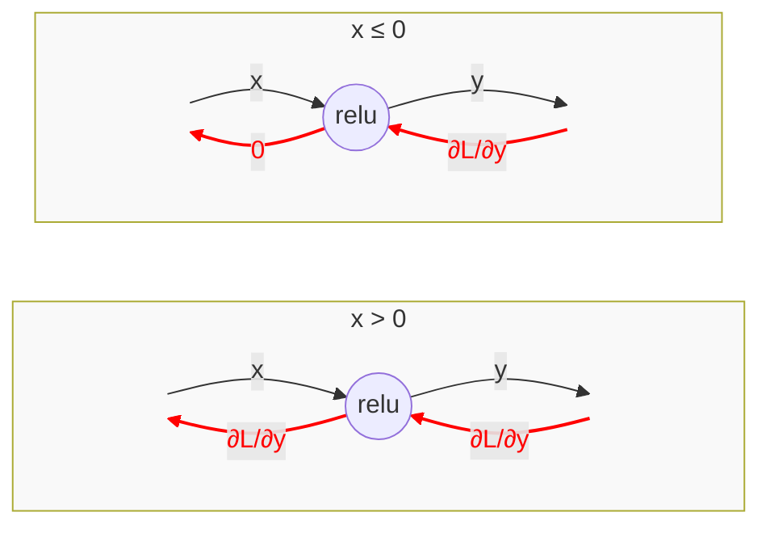

ReLU를 구현한 클래스는 아래와 같다.
class ReLU:
    def __init__(self):
        self.mask = None

    def forward(self, x, y):
        self.mask = (x <= 0)
        out = x.copy()
        out[self.mask] = 0

    return out

    def backward(self, dout):
        dout[self.mask] = 0
        dx = dout

        return dx

ReLU 클래스는 `mask`라는 인스턴스 변수를 갖는다. `mask`는 `True/False`로 구성된 넘파이 배열로, 순전파의 입력인 $x$의 원소 값이 0 이하인 인덱스는 `True`로, 그 외에는 `False`로 저장한다.
이를 통해 역전파 함수인 `backward()`를 호출할 때는 `mask`의 인덱스 값이 `True`인 곳에는 상류에서 전파된 `dout`을 0으로 한다.

문법적으로는 <b>Numpy 배열</b>에서만 동작하는 <b>Boolean Indexing</b>이며, 내부 동작은 <b>C언어</b>로 작성된 아래와 같은 반복문이다.


```c
/* 실제 NumPy 내부 구현의 개념적 형태 (C언어) */
void set_masked_values_to_zero(double* dout, bool* mask, int size) {
    // CPU가 처리하기 가장 좋은 형태의 단순 반복문
    for (int i = 0; i < size; i++) {
        if (mask[i]) {   // mask가 1(True)이면
            dout[i] = 0; // 바로 0으로 덮어씀
        }
    }
}
```

#### Sigmoid 계층
시그모이드 함수는 수식적으로 아래와 같다.

$$
y = \frac{1}{1+exp(-x)}
$$

Sigmoid 함수를 순전파 계산 그래프로 표현하면 아래와 같을 것이다.

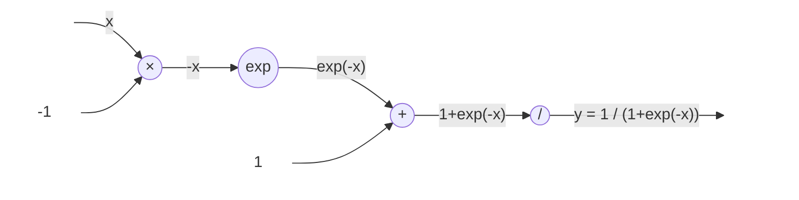

여기선 $×$과 $+$ 노드 외에 $exp$와 $/$ 노드가 새로 등장했다. $exp$ 노드는 $y = exp(x)$ 계산을 수행하고, $/$ 노드는 $y = \frac{1}{x}$ 계산을 수행한다.

Sigmoid의 역전파 흐름을 순서대로 정리하면 아래와 같다.

1. '$/$' 노드 ($y = \frac{1}{x}$)의 미분
$$
\frac{\partial y}{\partial x} = -\frac{1}{x^2} = -y^2
$$

위 수식에 따르면 역전파에선 상류에선 넘어온 값에 순전파 출력의 제곱에 마이너스를 붙인 값을 곱해서 하류로 전달하면 된다. 계산 그래프로는 아래와 같다.

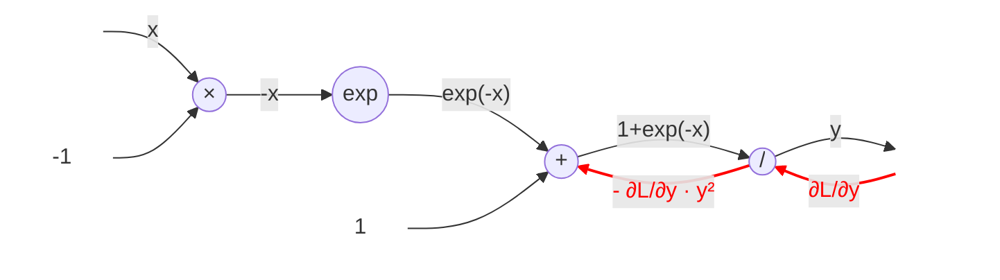

2. '$+$' 노드 (상류의 값을 그대로 내보냄)
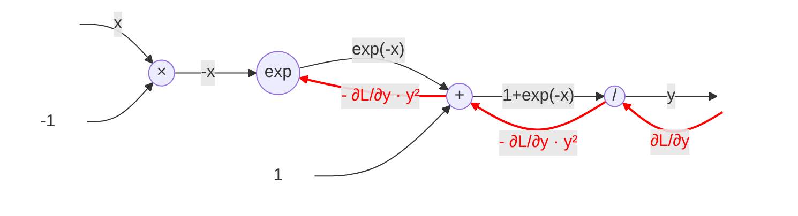

3. '$exp$' 노드
$y = exp()x$ 연산을 수행하고 그 미분은 아래와 같다.
$$
\frac{\partial y}{\partial x} = exp(x)
$$

계산 그래프 상에선 상류의 값에 순전파 출력($exp(-x)$)을 곱해 하류로 전달한다.

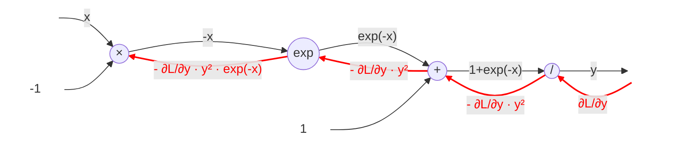

4. '$x$' 노드
'$x$' 노드는 순전파의 입력값을 서로 바꾼다.
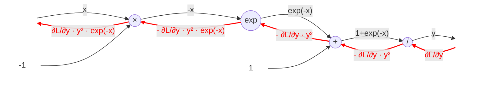

위의 그림을 보면 최종 출력인 $\frac{\partial L}{\partial y}y^2exp(-x)$의 값이 하류 노드로 전파되는 걸 볼 수 있다.
이 그래프는 순수하게 $x$와 $y$만으로 계산이 가능한 그래프이기 때문에 아래와 같이 간단하게 표현이 가능하다.

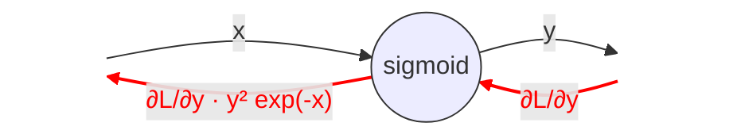

또한 $\frac{\partial L}{\partial y}y^2exp(-x)$는 아래와 같이 정리해서 작성이 가능하다.

$$
\frac{\partial L}{\partial y}y^2exp(-x) = \frac{\partial L}{\partial y}\frac{1}{(1+exp(-x))^2}exp(-x) = \frac{\partial L}{\partial y}\frac{1}{(1+exp(-x))}\frac{exp(-x)}{(1+exp(-x))} = \frac{\partial L}{\partial y}y(1-y)
$$

즉, sigmoid의 역전파는 순전파의 출력($y$)만으로도 계산할 수 있다.  
sigmoid 계층을 python으로 구현하면 아래와 같다.

```python
class Sigmoid:
    def __init__(self):
        self.out = None
    
    def forward(self,x):
        out = 1 / (1 + np.exp(-x))
        self.out = out

        return out
    
    def backward(self, dout):
        dx = dout * (1.0 - self.out) * self.out

        return dx
```

순전파의 출력을 인스턴스 변수 `out`에 보관했다가 역전파 계산 시, 사용하는 것이 핵심이다.

### Affine/Softmax 계층
#### Affine계층
신경망의 순전파에서는 가중치 신호의 총합을 계산하기 때문에 행렬의 곱(`np.dot()`)을 사용했다.

이 계산은 입력과 가중치 두 행렬을 서로 곱한 후, 편향을 더하는 방식으로 순전파가 진행되었고, 그 출력을 활성화 함수로 변환해 다음 층으로 전파는 게 신경망 순전파의 흐름이었다.
이때 행렬의 곱에선 <b>행렬의 형상</b>이 일치해야 계산이 가능했다.

예를 들어 $X(2,3)$라는 입력과 $W(3,1)$라는 가중치를 곱하는 것은 가능했으나 $X(2,2)$라는 입력과 $W(3,1)$라는 가중치를 곱하는 건 불가능했다.

신경망에서 순전파 때 수행하는 행렬의 곱은 기하학에서 <b>어파인 변환(Affine transformation)</b>이라고 한다. `np.dot()`라는 함수로 행렬의 곱은 쉽게 수행된다.
그러므로 `dot`라는 노드를 만들어서 계산 그래프로 신경망에 대한 순전파 그래프를 그려보면 아래와 같을 것이다.

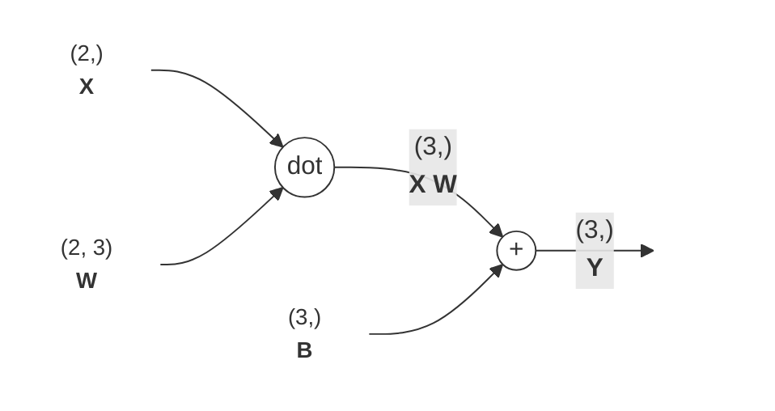

$W,X,B$는 모두 <b>행렬</b>임에 주의하자. 지금까지 계산 그래프에선 노드 사이에 스칼라값이 흘렀지만 이 그래프는 행렬이 흐르고 있다.

이 계산 그래프의 역전파에 대해서 생각해보자. 행렬을 사용한 역전파도 행렬의 원소마다 전개해보면 스칼라값을 사용한 지금까지의 계산 그래프와 같은 순서이다.
실제로 전개를 해보면 아래의 식이 도출된다.

$$
\frac{\partial L}{\partial X} = \frac{\partial L}{\partial Y} · W^T \\
\frac{\partial L}{\partial W} = X^T · \frac{\partial L}{\partial Y}
$$

위 식에서 $W^T$는 전치행렬을 의미한다. 전치행렬 $W$는 $(i,j)$ 위치의 원소를 $(j,i)$로 바꾼 걸 의미한다. 수식적으로는 아래와 같다.

$$
\mathbf{W} = \begin{pmatrix} 
w_{11} & w_{12} & w_{13} \\ 
w_{21} & w_{22} & w_{23} 
\end{pmatrix}

\\[1em] % 줄바꿈 간격

\mathbf{W}^{\mathrm{T}} = \begin{bmatrix} 
w_{11} & w_{21} \\ 
w_{12} & w_{22} \\ 
w_{13} & w_{23} 
\end{bmatrix}
$$

역전파 계산 그래프는 아래처럼 된다.

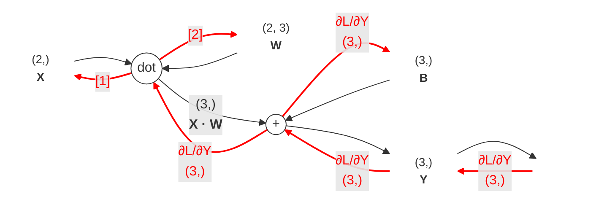

위 계산 그래프에선 각 변수의 형상에 주의해서 살펴보자. $X$와 $\frac{\partial L}{\partial X}$은 같은 형상이고, $W$와 $\frac{\partial L}{\partial W}$는 서로 같은 형상임을 기억해두자.
$X$와 $\frac{\partial L}{\partial X}$가 같은 형상이라는 건 아래의 식을 보면 명확해진다.

$$
\mathbf{X} = (x_0, x_1, \cdots, x_n)

\\[1em] % 줄바꿈 및 간격

\frac{\partial L}{\partial \mathbf{X}} = \left( \frac{\partial L}{\partial x_0}, \frac{\partial L}{\partial x_1}, \cdots, \frac{\partial L}{\partial x_n} \right)
$$

행렬의 형상에 주의해야 하는 이유는 행렬의 곱에선 대응하는 원소의 차원이 일치되어야 한다.

미분값의 형상은 원래 변수의 형상과 항상 일치한다면, 상류에서 넘어온 미분값의 형상에서 `dot` 노드는 어떤 형상을 곱해야 $X(2,)$ 형상을 만들 수 있을까?
그건 일반 혹은 미분한 W의 형상으로는 불가능하다. $(2,3)$ 따라서 $W$에 대한 전치행렬을 곱해야만 전파를 수행할 수 있다는 걸 알 수 있다. $(3,2)$

#### Softmax-with-loss 계층
마지막으로 출력층에서 사용하는 소프트맥스 함수에 대해서 알아보자.
앞에서 말했듯이 소프트맥스 함수는 입력 값을 정규화해 출력한다. 예를 들어 손글씨 숫자 인식에서 Softmax 계층의 출력은 아래와 같다.

```mermaid
flowchart LR
    %% 스타일 정의
    classDef block fill:#fff,stroke:#333,stroke-width:1px,rx:5,ry:5;
    classDef io fill:#lelele,stroke:none,font-weight:bold;

    %% 노드 정의
    Input[Input Image<br>'2']:::io
    
    subgraph Layers [Hidden Layers]
        direction LR
        Aff1[Affine]:::block
        ReLU1[ReLU]:::block
        Aff2[Affine]:::block
        ReLU2[ReLU]:::block
    end

    subgraph OutputLayer [Output Layer]
        direction LR
        Aff3[Affine]:::block
    end

    subgraph Results [Result]
        direction TB
        Scores["<b>점수 (Score)</b><br>5.3<br>0.3<br>10.1<br>...<br>0.01"]:::block
        Soft[Softmax]:::block
        Probs["<b>확률 (Prob)</b><br>0.008<br>0.00005<br>0.991 (99.1%)<br>...<br>0.00004"]:::block
    end

    %% 연결
    Input --> Aff1
    Aff1 --> ReLU1
    ReLU1 --> Aff2
    Aff2 --> ReLU2
    ReLU2 --> Aff3
    Aff3 --> Scores
    Scores --> Soft
    Soft --> Probs
```

이렇게 그림만 보면 잘 이해가 가질 않을 테니 맨 앞의 Affine 계층에서 다음 ReLU까지의 수행을 행렬의 곱이라는 수식적 표현으로 살펴보자.

먼저 손글씨 '2'라는 사진이 $28 × 28$이라는 크기를 가진다고 가정하자. 가장 먼저 이걸 Affine 계층에 넣기 위해선 <b>평탄화(flatten)</b> 작업을 거쳐서 1차원 벡터로 만든다.
$(1 * 784)$

그 후에는 Affine 연산을 수행한다, Affine 연산은 앞에서 계속 설명했던 것처럼 입력 * 가중치의 행렬 곱 연산에 편향을 더하면 된다. 만약 다음 층 뉴런의 개수를 50개라고 가정하면
아래와 같이 정리된다.

- 입력($X$): $(1,784)$ 형상 (데이터 1개, $N$이면 앞에가 $N$)
- 가중치($W$): $(784,50)$ 형상 (입력의 하나하나가 출력의 하나하나와 연결이 되어야 하므로)
- 편향($B$): $(50,0) 형상 (출력 뉴런의 개수만큼 더해줘야 함)

이를 행렬 모양으로 그리면 아래와 같다.

$$
\underbrace{ \begin{bmatrix} x_1 & x_2 & \dots & x_{784} \end{bmatrix} }_{(1, \ 784)}
\cdot
\underbrace{ \begin{bmatrix} w_{1,1} & \dots & w_{1,50} \\ \vdots & \ddots & \vdots \\ w_{784,1} & \dots & w_{784,50} \end{bmatrix} }_{(784, \ 50)}
+
\underbrace{ \begin{bmatrix} b_1 & \dots & b_{50} \end{bmatrix} }_{(50,)}
=
\underbrace{ \begin{bmatrix} y_1 & \dots & y_{50} \end{bmatrix} }_{(1, \ 50)}
$$

이후에 ReLU 함수에선 이렇게 입력받은 50개에 대해서 ReLU 함수를 수행한다. (1 이상이면 1, 아니면 0)

신경망에서 수행하는 작업은 학습과 추론이다. 추론 시 일반적으로 Softmax 계층을 사용하지 않는다. 위 계산 그래프 함수의 마지막 Affine 계층의 결과를 인식 결과로 사용한다는 의미이다.
또한 이러한 마지막 Affine 계층의 출력 결과를 <b>점수(Score)</b>라고 한다. 즉, 신경망 추론에서는 답을 내는 단 하나의 가장 높은 점수만 알면 되므로, 정규화를 거칠 필요가 없다. 반면 학습 시에는 Softmax 계층이 필요하다.

소프트 맥스 함수를 구현은 손실 함수인 교차 엔트로피 오차도 포함해서 `Softmax-with-loss` 계층이라는 이름으로 구현된다.
Softmax-with-loss의 계산 그래프는 아래와 같다.

<figure>
    
    <figcaption>Softmax-with-Loss 계층 계산 그래프</figcaption>
</figure>

이 복잡한 계산 그래프를 거치지만, 결국 맨 끝에서 맨 앞으로 돌아오는 미분 값은 `y - t`(예측값 - 정답)라는 아주 단순한 뺄셈이 된다는 거다.

이 그래프의 역전파를 하나하나 뜯어서 설명하면 아래와 같다.

##### 1. Cross Entropy Error의 역전파 박스 (오른쪽)
교차 엔트로피 오차의 수식은 아래와 같다.
$$
L = - \sum_{k} t_k \log y_k 
$$

이걸 $y_k$로 미분하면(역전파하면) 아주 간단해진다.
1.  로그의 미분: $(\log y)' = \frac{1}{y}$
2.  상수 곱: $-t_k$는 그대로 붙음.
3.  **결과:** $-\frac{t_k}{y_k}$

그림의 오른쪽 박스에서 $y_1, y_2, y_3$ 쪽으로 돌아가는 화살표에 $-\frac{t_1}{y_1}$ 등이 적혀 있는 이유다. 이것이 바로 뒤에서 넘어온 <b>오차 정보</b>다.

##### 2. Softmax의 역전파 (왼쪽 박스)
여기가 가장 핵심적이고 복잡한 부분이다. Softmax 식은 $y_k = \frac{\exp(a_k)}{S}$ 이다. ($S$는 전체 합 $\sum e^{a_i}$)

여기서 우리가 구해야 할 것은 <b>'입력 $a_k$가 변할 때, 최종 오차 $L$이 얼마나 변하는가?'</b> $\left( \frac{\partial L}{\partial a_k} \right)$ 이다.

그런데 Softmax는 입력 하나($a_k$)가 변하면 분모($S$)가 변하기 때문에, <b>출력되는 모든 $y_1, y_2, \dots, y_n$이 동시에 다 변하게 된다.</b>
즉, $a_k$에서 출발하여 오차 $L$에 도달하는 경로가 하나가 아니라 <b>$y$의 개수만큼 여러 갈래</b>라는 뜻이다.

따라서 <b>다변수 함수의 연쇄 법칙(Chain Rule)</b>에 의해, 모든 경로($y_i$)를 통해 들어온 영향력을 남김없이 다 더해야 한다.

$$
\frac{\partial L}{\partial a_k} = \sum_{i} \left( \frac{\partial L}{\partial y_i} \times \frac{\partial y_i}{\partial a_k} \right)
$$

이 식의 의미를 뜯어보면 다음과 같다.
*   $\frac{\partial L}{\partial y_i}$: 뒤(Cross Entropy)에서 넘어온 오차 정보
*   $\frac{\partial y_i}{\partial a_k}$: Softmax 자체의 미분 (입력 $a_k$가 $y_i$에 미치는 영향)
*   $\sum$: 이 둘을 곱한 값(각 경로의 영향력)을 <b>모두 합친다.</b>

참고로, $\frac{\partial y_i}{\partial a_k}$ 부분은 벡터를 벡터로 미분하는 것이기 때문에 사실상 <b>야코비안 행렬(Jacobian Matrix)</b>을 의미한다. 즉, 위 시그마 식은 <b>오차 정보 벡터와 Softmax 행렬의 내적(Dot Product)을 수행하는 과정</b>이라고 이해하면 된다.

이제 구체적으로 미분을 수행해 보자. 몫의 미분법 $\left( \frac{f}{g} \right)' = \frac{f'g - fg'}{g^2}$ 을 사용한다.

**2-1. <b>자기 자신$(i = k)$을 미분할 때</b> (행렬의 대각선 성분)**

분자와 분모 모두에 $a_k$가 있으므로 둘 다 미분된다.
- 분자 미분($f'$): $e^{a_k}$
- 분모 미분($g'$): $e^{a_k}$ (나머지항은 상수 취급되어 사라짐)

$$
\begin{aligned}
\frac{\partial y_k}{\partial a_k} &= \frac{e^{a_k}S - e^{a_k}e^{a_k}}{S^2} \\
&= \frac{e^{a_k}}{S} \left( \frac{S - e^{a_k}}{S} \right) \\
&= y_k (1 - y_k)
\end{aligned}
$$
<b>결과는 $y_k(1-y_k)$가 된다.</b>

**2-2. <b>다른 녀석$(i \neq k)$을 미분할 때</b> (행렬의 나머지 성분)**

분자에는 $a_k$가 없고($a_i$이므로 상수 취급), 분모($S$)에만 $a_k$가 있다.
- 분자 미분($f'$): $0$
- 분모 미분($g'$): $e^{a_k}$

$$
\begin{aligned}
\frac{\partial y_i}{\partial a_k} &= \frac{0 \cdot S - e^{a_i}e^{a_k}}{S^2} \\
&= -\frac{e^{a_i}}{S} \frac{e^{a_k}}{S} \\
&= -y_i y_k
\end{aligned}
$$
<b>결과는 $-y_ky_i$가 된다.</b>

##### 3. 최종 결합
이제 위에서 구한 재료들을 시그마 식에 대입하여 합친다. 시그마($\sum$)를 <b>'자기 자신($k$)'</b>과 <b>'나머지($i \neq k$)'</b>로 쪼개서 전개해보면 놀라운 일이 일어난다.

$$
\begin{aligned}
\frac{\partial L}{\partial a_k} &= \underbrace{\left( -\frac{t_k}{y_k} \right) \cdot y_k(1-y_k)}_{\text{자기 자신}} + \sum_{i \neq k} \underbrace{\left( -\frac{t_i}{y_i} \right) \cdot (-y_k y_i)}_{\text{나머지들}} \\
\\
&= (-t_k + t_k y_k) + \sum_{i \neq k} (t_i y_k) \quad \leftarrow \text{여기서 분모 } y_i \text{가 약분되어 사라짐!} \\
\\
&= -t_k + y_k \underbrace{(t_k + \sum_{i \neq k} t_i)}_{\text{전체 정답의 합}} \quad \leftarrow \text{공통인수 } y_k \text{로 묶음}
\end{aligned}
$$

여기서 **원-핫 인코딩의 성질**이 나타난다. 정답 레이블 $t$는 하나만 1이고 나머지는 0이므로, <b>모든 $t$를 더하면 무조건 1이다</b>. ($\sum t_i = 1$)

$$
\begin{aligned}
&= -t_k + y_k \cdot 1 \\
&= \mathbf{y_k - t_k}
\end{aligned}
$$

*   **$y_k$**: 신경망이 예측한 확률 (예: 0.8)
*   **$t_k$**: 실제 정답 (예: 1.0)
*   **역전파 값**: $0.8 - 1.0 = -0.2$ (오차만큼만 갱신해라!)

##### 4. 결론
이 복잡한 그래프를 그리는 이유는, <b>Softmax 함수와 Cross Entropy Error를 짝지어 쓰면(Softmax-with-Loss), 역전파 계산이 $y-t$로 단순해진다</b>는 것을 보여주기 위함이다.

*   회귀 문제에서 <b>Identity(항등) 함수 + MSE(평균제곱오차)</b>를 쓸 때도 똑같이 $y-t$가 나온다.
*   이는 우연이 아니라, <b>딥러닝 프레임워크를 설계할 때 미분 계산을 빠르고 효율적으로 하기 위해 의도적으로 이렇게 짝을 맞춘 것</b>이다. (Canonical Link Function)

그래서 우리는 복잡한 미분 공식을 매번 풀 필요 없이, <b>"아, 예측값에서 정답을 뺀 값($y-t$)을 그냥 앞쪽으로 던져주면 되는구나!"</b> 하고 직관적으로 이해하고 넘어가면 된다.

참고로 이 둘이 이렇게 짝꿍으로 사용된 건 통계학을 이용한 설계이다.  

통계학에는 <b>GLM(일반화 선형 모델)</b>이라는 이론이 존재한다. 여기서 어떠한 확률 분포(Softmax의 경우 다항 분포)를 따를 때, 가장 자연스러운 <b>짝꿍 함수(Canonical Link Function)</b>를 사용할 경우 미분 결과가 항상 <b>예측 - 정답</b>으로 나오다는 게 수학적으로 증명되어 있다.

따라서 미분했을 때,$y - t$가 나오기 위해선 Softmax의 함수로는 반드시 로그를 취하는 함수를 써야 하고 그 중 CEE가 최적이라는 걸 역추적해서 설계한 것이다.

