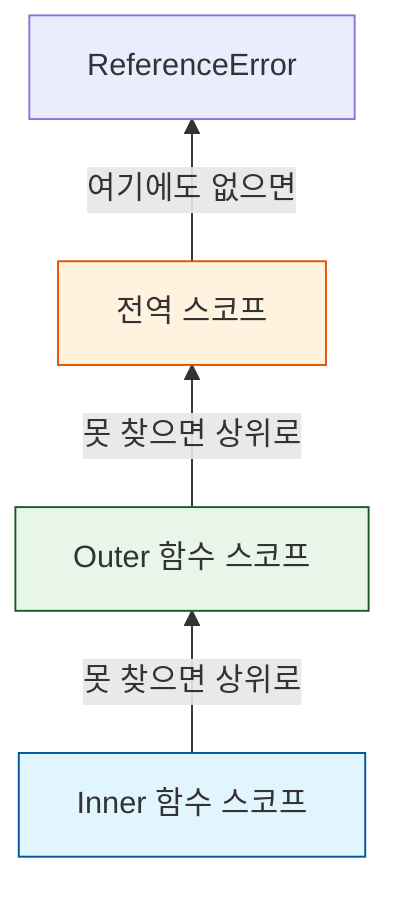

## 프론트엔드 면접의 단골 손님

자바스크립트를 공부하다 보면 `this`, `Prototype`, `Closure` 같은 개념에서 한 번쯤 막히게 된다.
특히 <b>클로저(Closure)</b>는 "함수와 함수가 선언된 어휘적 환경의 조합"이라는 난해한 정의 때문에 초보자들이 가장 어려워하는 개념 중 하나다.

하지만 React의 `useState`나 각종 라이브러리(Lodash, Moment 등) 내부에서 클로저가 활발히 사용되고 있기 때문에, 중급 개발자로 넘어가기 위해서는 반드시 짚고 넘어가야 한다.

이 글은 클로저를 이해하기 위한 선수 지식인 <b>스코프(Scope)</b>부터 시작해 클로저의 원리와 활용까지 정리한 글이다.

---

## 1. 스코프(Scope)와 렉시컬 스코프

### 1-1. 스코프의 정의
스코프는 <b>"변수나 함수에 접근할 수 있는 유효 범위"</b>를 의미한다.
어떤 변수가 어디서 선언되었느냐에 따라 그 변수를 참조할 수 있는 위치가 결정된다. 만약 스코프를 벗어난 변수를 참조하려 하면 `ReferenceError`가 발생한다.

- **전역 스코프 (Global)**: 코드 어디서든 접근 가능
- **지역 스코프 (Local)**: 함수 스코프, 블록 스코프(`let`, `const`) 등으로 나뉨

### 1-2. 렉시컬 스코프 (Lexical Scope)
자바스크립트의 가장 중요한 특징 중 하나는 <b>렉시컬 스코프(정적 스코프)</b>를 따른다는 점이다.

> **Lexical Scope란?**  
> 함수를 어디서 <b>"호출"</b>했는지가 아니라, 어디서 <b>"선언(정의)"</b>했는지에 따라 상위 스코프가 결정되는 방식.

```javascript
var x = 1;

function foo() {
  var x = 10;
  bar(); // 여기서 호출했지만
}

function bar() {
  console.log(x); // bar는 전역에 선언되었으므로 전역 x를 바라본다.
}

foo(); // 결과: 1
```

### 1-3. 스코프 체인과 변수 탐색 과정
자바스크립트 엔진은 변수를 찾을 때 <b>현재 환경(Environment Record)</b>에서 먼저 찾고, 없으면 <b>외부 렉시컬 환경 참조(Outer Reference)</b>를 통해 상위 스코프로 이동하며 찾는다.



---

## 2. 클로저(Closure): 죽지 않는 함수

### 2-1. 클로저의 탄생 배경
일반적으로 함수 실행이 끝나고 `return` 되면, 함수 내부의 변수들은 가비지 컬렉터(Garbage Collector)에 의해 메모리에서 삭제된다.
그런데 **함수가 종료된 이후에도 내부 변수를 계속 사용하고 싶다면** 어떻게 해야 할까?

이때 사용하는 것이 바로 **클로저**다.

### 2-2. 클로저의 정의와 동작 원리
클로저란 <b>"외부 함수보다 중첩 함수(내부 함수)가 더 오래 유지되는 경우, 외부 함수의 변수를 참조할 수 있는 현상"</b>을 말한다.

```javascript
function createCounter() {
  let count = 0; // 은닉된 변수

  return function() { // 내부 함수 반환 (클로저)
    count++;
    return count;
  };
}

const counter = createCounter(); // createCounter 실행 끝남 (원래라면 count 소멸)
console.log(counter()); // 1 (하지만 count는 살아있다!)
console.log(counter()); // 2
```

1.  `createCounter`가 실행되고 익명 함수를 반환하며 종료된다.
2.  일반적으로는 `count` 변수도 메모리에서 사라져야 한다.
3.  하지만 반환된 내부 함수가 `count`를 참조하고 있기 때문에, 자바스크립트 엔진은 <b>이 환경을 파괴하지 않고 유지(Capture)</b>한다.
4.  결과적으로 외부에서는 `count`에 직접 접근할 수 없지만, `counter()` 함수를 통해서만 값을 조작할 수 있게 된다.

---

## 3. 클로저를 왜 사용할까?

### 3-1. 캡슐화와 정보 은닉 (Encapsulation)
전역 변수는 누구나 수정할 수 있어 위험하다. 클로저를 사용하면 <b>상태(State)를 안전하게 은닉(Private Variable)</b>하고, 특정 함수를 통해서만 상태를 변경하도록 강제할 수 있다. 이는 자바스크립트에서 **모듈 패턴**을 구현하는 핵심 방식이다.

```javascript
const counter = (function() {
  let num = 0; // 외부에서 접근 불가 (Private)

  return {
    increase() { return ++num; },
    decrease() { return --num; },
    getNum() { return num; }
  };
})();

console.log(counter.num); // undefined (접근 불가)
console.log(counter.increase()); // 1
```

### 3-2. 상태 유지 (State Management)
대표적인 예시가 바로 React의 `useState`다.
함수형 컴포넌트는 렌더링될 때마다 함수가 다시 호출되는데, 어떻게 이전 상태값을 기억하는 걸까? 바로 React 내부적으로 클로저를 사용하여 상태를 저장하고 관리하기 때문이다.

---

<div class="flex items-center gap-2"><svg class="w-10 h-10 text-gray-800 dark:text-gray-200" fill="none" xmlns="http://www.w3.org/2000/svg" viewBox="0 0 24 24"><path d="M5 3H3v18h18V3H5zm0 2h14v14H5V5zm4 7H7v2h2v2h2v-2h2v-2h2v-2h2V8h-2v2h-2v2h-2v2H9v-2z" fill="currentColor"/></svg><span class="font-bold text-2xl">글 요약</span></div>

- **렉시컬 스코프**: 변수의 유효 범위는 코드를 작성한 위치(선언 위치)에 따라 정적으로 결정된다.
- **클로저**: 외부 함수가 종료되어도, 내부 함수가 외부 함수의 변수를 참조하고 있다면 그 변수는 사라지지 않고 기억된다.
- **활용**: 클로저를 사용하면 전역 변수 사용을 억제하고, 데이터를 <b>은닉(Private)</b>하며, 상태를 안전하게 **유지**할 수 있다. (React Hooks의 원리)