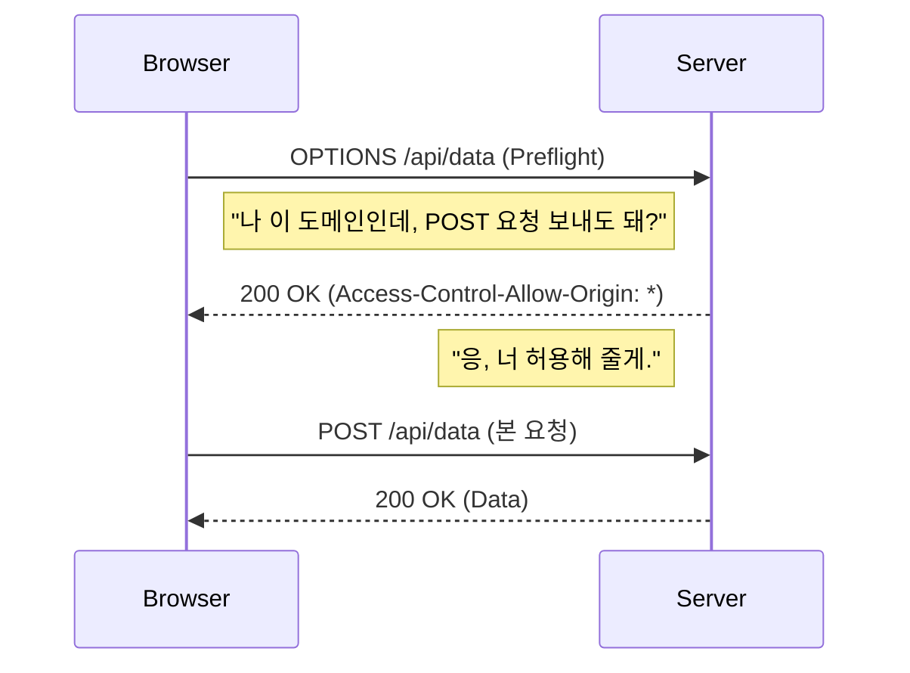
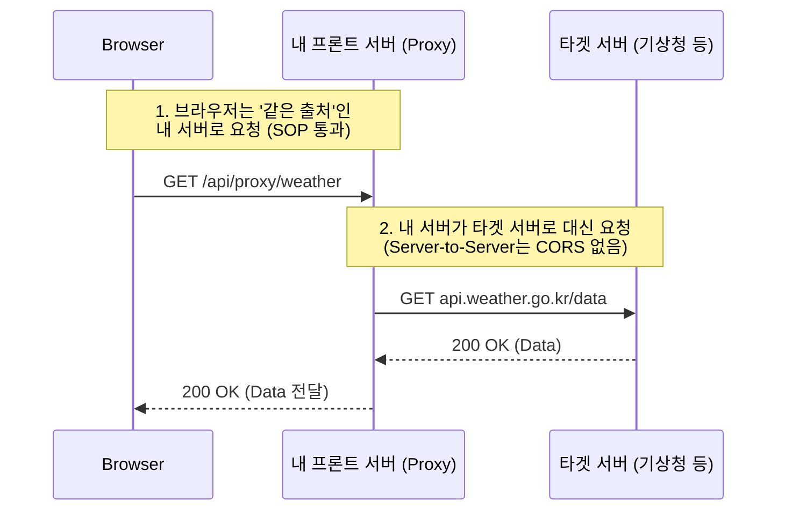

## 브라우저의 보안과 저장소

웹 개발을 하다 보면 빨간색으로 도배된 **CORS 에러**를 마주하거나, 로그인 정보를 **쿠키**에 담을지 **로컬 스토리지**에 담을지 고민하게 된다.
이 글은 브라우저가 왜 다른 출처의 리소스를 막는지(SOP & CORS), 그리고 데이터를 브라우저에 저장하는 세 가지 방법(Cookie, LocalStorage, SessionStorage)의 차이를 명확히 정리한 글이다.

---

## 1. CORS (Cross-Origin Resource Sharing)

### 1-1. SOP (Same-Origin Policy)
CORS를 알기 전에 먼저 <b>SOP(동일 출처 정책)</b>를 알아야 한다.
SOP는 브라우저의 기본적인 보안 정책으로, <b>"같은 출처(Origin)에서만 리소스를 공유할 수 있다"</b>는 원칙이다.

> **출처(Origin)란?**  
> `Protocol` + `Domain` + `Port` 세 가지가 모두 같아야 같은 출처로 인정된다.
> - `https://www.naver.com:443` (기준)
> - `http://www.naver.com` (프로토콜 다름 → 다른 출처)
> - `https://api.naver.com` (도메인 다름 → 다른 출처)

만약 SOP가 없다면? 해커가 만든 사이트에서 내가 로그인한 네이버 세션을 몰래 이용해 개인정보를 탈취(CSRF 등)할 수 있다.

### 1-2. CORS의 등장
하지만 현대 웹에서는 다른 도메인(API 서버, CDN 등)의 리소스를 가져와야 하는 경우가 너무 많다. 그래서 "<b>조건을 만족하면 다른 출처라도 리소스 공유를 허용해 줄게!</b>"라고 나온 것이 바로 **CORS**다.

### 1-3. 동작 원리 (Preflight Request)
브라우저는 보안상 민감한 요청(POST, PUT, 커스텀 헤더 등)을 보낼 때, 본 요청 전에 <b>"나 이거 보내도 돼?"</b>라고 묻는 <b>예비 요청(Preflight Request, OPTIONS 메서드)</b>을 먼저 보낸다.



서버가 응답 헤더(`Access-Control-Allow-Origin`)에 허용된 출처를 명시해 주면, 브라우저는 그때서야 실제 데이터 요청을 보낸다.

#### 1-3-1. 예외: Preflight가 생략되는 "단순 요청" (Simple Request)

모든 CORS 요청이 Preflight(예비 요청)를 보내는 것은 아니다. 브라우저는 **"이 정도 요청은 기존 웹(HTML Form 등)에서도 흔하게 하던 거니까 안전해!"**라고 판단되면 예비 검사를 생략하고 바로 본 요청을 보낸다. 이를 <b>단순 요청(Simple Request)</b>이라고 한다.

하지만 이 조건이 꽤 까다롭다. 아래 **3가지 조건을 모두 만족**해야만 한다.

1.  **HTTP 메서드**:
    *   `GET`, `HEAD`, `POST` 중 하나여야 한다. (PUT, DELETE 등은 무조건 Preflight 발생)
2.  **허용된 헤더 (Header)**:
    *   브라우저가 기본적으로 설정하는 헤더 외에, 사용자가 추가한 커스텀 헤더가 없어야 한다.
    *   허용된 헤더: `Accept`, `Accept-Language`, `Content-Language`, `Content-Type`
3.  **Content-Type (가장 중요)**:
    *   `Content-Type` 헤더가 다음 세 가지 중 하나여야 한다.
        *   `application/x-www-form-urlencoded` (기본 HTML Form)
        *   `multipart/form-data` (파일 업로드)
        *   `text/plain` (단순 텍스트)

#### 왜 내 API 요청은 항상 Preflight가 뜰까?
요즘 웹 개발(REST API)에서는 데이터를 주고받을 때 대부분 `application/json`을 사용한다.
하지만 위 조건을 보면 알겠지만, **`application/json`은 단순 요청의 조건에 포함되지 않는다.**

```javascript
// 흔한 API 요청 코드
fetch('https://api.server.com', {
  method: 'POST',
  headers: {
    'Content-Type': 'application/json', // ⚠️ 단순 요청 조건 탈락!
    'Authorization': 'Bearer token...'  // ⚠️ 커스텀 헤더 사용으로 탈락!
  },
  body: JSON.stringify({ data: 'hello' })
});
```

위와 같이 JSON 데이터를 보내거나 인증 토큰(Authorization)을 헤더에 싣는 순간, 브라우저는 이를 <b>복잡한 요청</b>으로 간주하고 무조건 <b>Preflight</b>(`OPTIONS`)를 먼저 날린다.

> **요약**: 우리가 만드는 대다수의 모던 웹 애플리케이션(JSON 통신)은 **거의 100% 확률로 Preflight 요청을 동반**한다고 보면 된다. 그러니 네트워크 탭에 `OPTIONS` 메서드가 찍혀도 당황하지 말자. 정상적인 보안 절차다.

### 1-4. CORS 해결 방법: 상황별 공략법

CORS 에러를 만났을 때 해결하는 방법은 크게 두 가지다. <b>"내가 서버를 고칠 수 있느냐, 없느냐"</b>에 따라 방법이 갈린다.

#### 상황 A: 백엔드가 내 것일 때 (Server-side Configuration)
내가 만든 서버거나, 우리 회사 백엔드 팀에게 요청할 수 있다면 **정석적인 방법**을 써야 한다. 서버에서 "이 도메인은 접속해도 좋아!"라고 허용해 주는 것이다.

*   **원리**: 서버 응답 헤더(`Access-Control-Allow-Origin`)에 프론트엔드의 도메인을 넣어준다.
*   **구현 예시 (Node.js/Express)**:
    `cors` 라이브러리를 사용하면 아주 간단하게 설정할 수 있다.

```javascript
const express = require('express');
const cors = require('cors');
const app = express();

// 특정 도메인만 허용 (보안 권장)
app.use(cors({
    origin: 'https://my-blog.com' 
}));

// 혹은 모든 도메인 허용 (개발 단계 등)
// app.use(cors());
```

#### 상황 B: 남의 API를 쓸 때 (Proxy)
공공 데이터 포털(기상청 등)이나 외부 API를 쓰는데 CORS 에러가 난다면? 내가 그 서버 설정을 바꿀 수 없으므로 <b>프록시(Proxy)</b>를 써야 한다.

*   **원리**: <b>"서버끼리는 CORS가 없다"</b>는 점을 이용한다. 브라우저가 직접 타겟 서버로 요청하는 게 아니라, 내 프론트엔드 서버(Next.js 등)가 중간 다리 역할을 한다.



*   **구현 예시 (Next.js next.config.js)**:
    `rewrites` 설정을 이용하면 쉽게 프록시를 구현할 수 있다.

```javascript
// next.config.js
module.exports = {
  async rewrites() {
    return [
      {
        source: '/api/weather/:path*', // 브라우저는 이 주소로 요청함
        destination: 'https://api.weather.go.kr/:path*', // 실제로는 여기로 감
      },
    ];
  },
};
```

---

## 2. 브라우저 저장소 3대장: Cookie vs LocalStorage vs SessionStorage

서버가 아닌 클라이언트(브라우저)에 데이터를 저장하는 방법은 크게 세 가지가 있다.

### 2-1. 쿠키 (Cookie)
가장 오래된 저장소로, **서버와 통신하기 위해 만들어진 작은 데이터 조각**이다.

*   **특징**: 매 HTTP 요청마다 **헤더에 자동으로 포함되어 서버로 전송**된다.
*   **용량**: 약 4KB로 매우 작음.
*   **만료**: `Expires`나 `Max-Age`로 만료 기한을 설정할 수 있다.
*   **용도**: 주로 서버가 사용자를 인증(Session ID)하거나 추적할 때 사용된다.

### 2-2. 웹 스토리지 (Web Storage)
HTML5에서 추가된 저장소로, **서버로 전송되지 않고 브라우저에만 저장**된다. 용량도 약 5MB로 넉넉하다. 데이터의 영구성에 따라 두 가지로 나뉜다.

#### A. 로컬 스토리지 (localStorage)
*   **영구성**: 브라우저나 탭을 닫아도 **데이터가 영구적으로 유지**된다.
*   **공유**: 동일한 도메인이라면 여러 탭이나 창 간에 데이터가 공유된다.
*   **용도**: 자동 로그인 여부, 테마 설정(Dark Mode), 장바구니 등 지워지면 안 되는 데이터.

#### B. 세션 스토리지 (sessionStorage)
*   **휘발성**: 탭이나 **브라우저를 닫으면 데이터가 즉시 삭제**된다.
*   **격리**: 동일한 도메인이라도 탭이 다르면 데이터가 공유되지 않는다. (각 탭마다 별도 저장)
*   **용도**: 입력 폼 임시 저장, 일회성 로그인 정보 등.

### 3. 한 눈에 비교하기

| 구분 | Cookie | LocalStorage | SessionStorage |
| :--- | :--- | :--- | :--- |
| **저장 위치** | 브라우저 | 브라우저 | 브라우저 |
| **서버 전송** | **O (매 요청마다)** | X | X |
| **용량** | 4KB | 5MB | 5MB |
| **데이터 유지** | 만료 기한까지 | **반영구적 (지울 때까지)** | **탭 닫을 때까지** |
| **탭 간 공유** | O | O | **X (탭별 격리)** |

---

<div class="flex items-center gap-2"><svg class="w-10 h-10 text-gray-800 dark:text-gray-200" fill="none" xmlns="http://www.w3.org/2000/svg" viewBox="0 0 24 24"><path d="M5 3H3v18h18V3H5zm0 2h14v14H5V5zm4 7H7v2h2v2h2v-2h2v-2h2v-2h2V8h-2v2h-2v2h-2v2H9v-2z" fill="currentColor"/></svg><span class="font-bold text-2xl">글 요약</span></div>

- **CORS**: 브라우저 보안(SOP) 때문에 발생하는 에러로, 서버가 허용 헤더(`Access-Control-Allow-Origin`)를 내려줘야 해결된다.
    - **내 서버라면?**: 백엔드 코드에 <b>CORS 설정</b>(`Access-Control-Allow-Origin`)을 추가하여 브라우저를 안심시킨다.
    - **남의 서버라면?**: <b>프록시(Proxy)</b> 서버를 통해 브라우저 몰래 데이터를 받아온다. (CORS는 브라우저만 막기 때문)
- **Preflight**: 안전하지 않은 요청은 브라우저가 `OPTIONS` 메서드로 서버에 미리 허용 여부를 묻는다.
- **저장소 선택**: 서버로 보내야 하는 데이터는 **Cookie**, 영구 저장이 필요하면 **LocalStorage**, 잠깐 쓰고 버릴 거면 **SessionStorage**를 사용한다.
