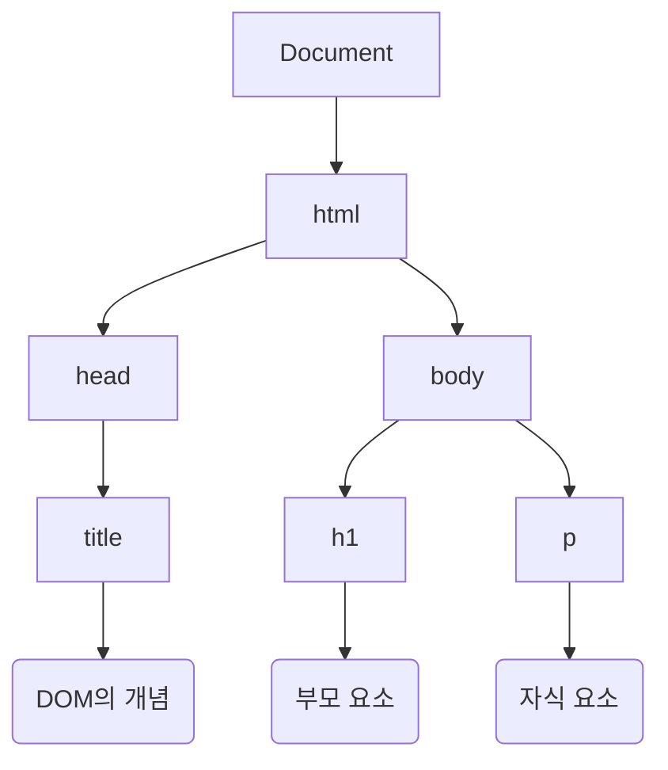

## DOM(Document Object Model)이란?
웹 개발을 하다 보면 수도 없이 듣게 되는 단어, 바로 <b>DOM(돔)</b>이다.
"DOM 조작", "Virtual DOM" 등 수많은 용어 속에서 우리는 DOM을 얼마나 정확히 이해하고 있을까?
단순히 HTML 태그를 자바스크립트로 가져오는 것이라고만 알고 있다면 반쪽짜리 지식일 수 있다.

이 글은 DOM의 정확한 정의와 왜 이것이 필요한지, 그리고 왜 트리 구조로 생겨먹었는지에 대한 핵심 개념을 정리한 글이다.

### 1. DOM의 정의
DOM(Document Object Model)은 **HTML이나 XML 같은 마크업 언어로 작성된 문서를 프로그래밍 언어가 조작할 수 있도록 하는 인터페이스**를 의미한다.

우리가 작성한 HTML 코드는 그 자체로는 단순한 텍스트 파일(문자열)에 불과하다. 브라우저가 이 코드를 이해하고 화면에 그리기 위해서는 브라우저가 이해할 수 있는 객체(Object) 형태로 변환되어야 하는데, 이 결과물이 바로 DOM이다.

- **문서(Document)**: HTML, XML 등 마크업 문서
- **객체(Object)**: 프로그래밍 언어(JS)가 접근 가능한 형태
- **모델(Model)**: 문서의 구조와 관계를 표현

즉, <b>DOM은 자바스크립트가 HTML 문서에 접근하여 읽고 쓰고 수정할 수 있도록 만들어진 '연결 통로(Interface)'</b>이다.

### 2. DOM은 왜 필요한가?
HTML만 있어도 웹 페이지는 뜬다. 그런데 왜 굳이 DOM이라는 중간 다리가 필요할까?
이유는 **정적인 문서를 동적으로 제어하기 위해서**이다.

> "HTML 문서는 **TV**와 같고, DOM은 **리모컨**과 같다."

- **HTML (TV)**: 방송국에서 송출한 화면을 보여주기만 한다. (정적)
- **자바스크립트 (시청자)**: 채널을 돌리거나 볼륨을 키우고 싶어 한다.
- **DOM (리모컨)**: 시청자의 의도(JS 코드)를 TV(HTML)에 전달하여 상태를 변화시킨다.

만약 리모컨(DOM)이 없다면 우리는 TV 화면(HTML)을 멍하니 바라볼 수만 있을 뿐, 채널을 바꾸거나(화면 전환), 볼륨을 조절하는(스타일 변경) 등의 상호작용을 전혀 할 수 없을 것이다.

따라서 **문서에 접근하고 제어할 수 있는 수단**으로서 DOM이 필수적이다.

### 3. DOM의 구조 (Tree Structure)
DOM은 <b>노드(Node)</b>라고 불리는 객체들이 계층적으로 연결된 <b>트리(Tree)</b> 구조를 가지고 있다.

#### 3-1. DOM 트리 시각화 (Mermaid)
아래는 간단한 HTML 문서가 DOM 트리로 변환되었을 때의 구조다.

#### 3.2 DOM은 왜 계층적(Tree) 구조일까?
왜 DOM은 굳이 트리 구조를 선택한 걸까? 단순히 보기 좋아서가 아니다.  
가장 큰 이유는 <b>명확한 관계 정의와 효율적인 제어</b> 때문이다.

1. <b>관계의 명확성</b>: 모든 노드는 '부모(Parent)', '자식(Child)', '형제(Siblings)'라는 명확한 관계를 갖는다.  
2. <b>조작의 용이성</b>: 'body의 첫 번째 자식'과 같이 경로를 통해 요소를 탐색하고 추가/삭제하기가 쉬워진다.  
3. <b>이벤트의 전파(Event Propagation)</b>: 트리 구조이기 때문에 <b>이벤트 버블링(Event Bubbling)</b>이나 <b>캡처링(Capturing)</b>이 가능하다.
    - 클릭 이벤트가 발생했을 때 하위에서 상위로 전달(버블링)하거나 상위에서 하위로 전달(캡처링)하는 건 계층 구조이기 때문에 가능한 기작이다.

### 4. DOM을 이용한 주요 동작
DOM API를 통해 우리는 자바스크립트로 HTML을 맘대로 조작할 수 있다. 주요 기능을 표로 정리해 보았다.

#### 4-1. 요소 접근 및 탐색 (Select)

<table>
<caption>요소 선택 관련 메서드</caption>
<thead>
<tr>
<th>메서드</th>
<th>설명</th>
<th>비고</th>
</tr>
</thead>
<tbody>
<tr>
<td><b>getElementById</b></td>
<td><code>id</code> 속성으로 요소 하나를 선택.</td>
<td>가장 빠르고 명시적임.</td>
</tr>
<tr>
<td><b>querySelector</b></td>
<td>CSS 선택자를 이용해 <b>첫 번째</b> 요소 하나를 선택.</td>
<td>유연하게 사용 가능.</td>
</tr>
<tr>
<td><b>querySelectorAll</b></td>
<td>CSS 선택자와 일치하는 <b>모든</b> 요소를 NodeList로 반환.</td>
<td>배열 메서드(forEach 등) 사용 가능.</td>
</tr>
</tbody>
</table>

#### 4-2. 요소 조작 및 변경 (Manipulation)
<table>
<caption>요소 조작 관련 기능</caption>
<thead>
<tr>
<th>구분</th>
<th>속성/메서드</th>
<th>설명</th>
</tr>
</thead>
<tbody>
<tr>
<td rowspan="2"><b>생성 및 추가</b></td>
<td><b>createElement</b></td>
<td>새로운 HTML 요소를 메모리 상에 생성.</td>
</tr>
<tr>
<td><b>appendChild</b></td>
<td>생성된 요소를 특정 부모 요소의 자식으로 삽입.</td>
</tr>
<tr>
<td rowspan="2"><b>제거 및 수정</b></td>
<td><b>remove</b></td>
<td>선택한 요소를 DOM 트리에서 삭제.</td>
</tr>
<tr>
<td><b>innerHTML / textContent</b></td>
<td>요소 내부의 HTML이나 텍스트 내용을 변경.</td>
</tr>
<tr>
<td><b>이벤트</b></td>
<td><b>addEventListener</b></td>
<td>클릭, 입력 등 사용자의 행동(Event)을 감지하여 함수 실행.</td>
</tr>
</tbody>
</table>

---

<svg class="w-10 h-10 text-gray-800 dark:text-gray-200" fill="none" xmlns="http://www.w3.org/2000/svg" viewBox="0 0 24 24"><path d="M5 3H3v18h18V3H5zm0 2h14v14H5V5zm4 7H7v2h2v2h2v-2h2v-2h2v-2h2V8h-2v2h-2v2h-2v2H9v-2z" fill="currentColor"/></svg>글 요약

- <b>정의</b>: DOM은 마크업 문서(HTML)와 프로그래밍 언어(JS)를 이어주는 <b>인터페이스(다리)</b>이다.
- <b>필요성</b>: 정적인 HTML에 생명(동적 기능)을 불어넣기 위해, 문서를 제어할 수 있는 도구(리모컨)가 필요해서 만들어졌다.
- <b>구조</b>: 트리(Tree) 구조로 되어 있어 부모-자식 관계가 명확하며, 이를 통해 효율적인 탐색과 <b>이벤트 전파(버블링/캡처링)</b>가 가능하다.
- <b>기능</b>: 자바스크립트는 DOM을 통해 요소를 선택(Select)하고, 내용을 변경(Modify)하며, 이벤트를 감지(Event Listen)할 수 있다.