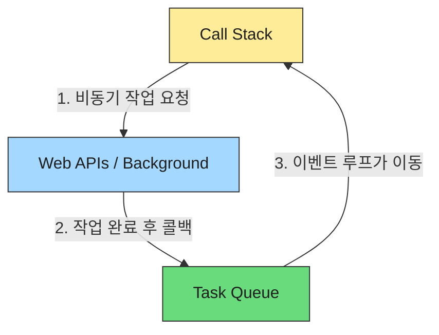

## 자바스크립트는 몸이 하나다 (Single Thread)

자바스크립트를 공부하다 보면 가장 먼저 듣는 말 중 하나가 <b>"자바스크립트는 싱글 스레드 언어다"</b>라는 말이다.
이 말인즉슨, 자바스크립트는 **한 번에 딱 한 가지 일만 처리할 수 있다**는 뜻이다.

```javascript
console.log(1+1); // 이거 끝나야
console.log(2+2); // 이거 하고
console.log(3+3); // 이거 한다
```

그런데 우리가 사용하는 웹 사이트는 어떤가?
서버에서 데이터를 받아오면서(네트워크), 동시에 사용자의 클릭을 처리하고(이벤트), 애니메이션도 보여준다.
**몸이 하나인 자바스크립트가 어떻게 이 모든 일을 동시에 하는 것처럼 처리할 수 있을까?**

이 글은 그 과정의 원리인 <b>자바스크립트 실행 환경(Runtime)</b>과 <b>이벤트 루프(Event Loop)</b>에 대해 정리한 글이다.

### 1. 왜 비동기 처리가 필요한가?
만약 자바스크립트가 모든 일을 혼자서 순차적으로만 처리한다면 끔찍한 일이 벌어진다.

- **상황**: 서버에 데이터를 요청했는데 응답이 오기까지 3초가 걸린다.
- **동기 처리**: 자바스크립트는 그 3초 동안 **아무것도 못 하고 멈춰 있는다(Block).** 클릭도 안 되고, 스크롤도 안 된다.

이런 **"Thread Blocking"** 현상을 막기 위해, 시간이 오래 걸리는 작업(네트워크 요청, 파일 읽기 등)은 **"나중에 완료되면 알려줘!"** 하고 맡겨버리고 다음 일을 해야 한다. 이것이 **비동기 처리**다.

### 2. 자바스크립트의 조력자들 (실행 환경)
여기서 오해하면 안 되는 중요한 사실이 있다. 자바스크립트 엔진(V8 등)은 명백히 싱글 스레드가 맞다. 즉, 우리가 작성한 코드를 읽고 실행하는 '주인공(Main Thread)'은 오직 한 명뿐이다.

하지만 이 주인공이 활동하는 무대인 <b>실행 환경(브라우저, Node.js)</b>은 멀티 스레드다. 브라우저는 자바스크립트 엔진 외에도 네트워크 통신, 타이머, DOM 렌더링 등을 처리하는 별도의 스레드(일꾼)들을 거느리고 있다.

이 협업 구조 덕분에 자바스크립트는 혼자 일하면서도 마치 여러 일을 동시에 하는 것처럼 보일 수 있는 것이다.



- **Call Stack (메인 스레드)**: 자바스크립트가 실제로 일하는 작업 공간. 함수가 호출되면 쌓이고(Push), 끝나면 나간다(Pop).
- **Background (Web APIs / libuv)**: 브라우저나 Node.js가 제공하는 **멀티 스레드 공간**. 비동기 작업(setTimeout, fetch 등)은 여기서 처리된다.
- **Task Queue (Callback Queue)**: Background에서 처리가 끝난 작업의 **콜백 함수들이 대기하는 줄**이다.
- **Event Loop**: Call Stack이 비어있는지 계속 확인하다가, **비어있으면 Queue에 있는 작업을 Call Stack으로 옮겨주는 짐꾼**이다.

### 3. 동작 과정 시뮬레이션
아래 코드가 어떻게 실행되는지 순서대로 살펴보자.

```javascript
console.log('1. 시작');

setTimeout(() => {
  console.log('2. 타임아웃');
}, 0);

console.log('3. 끝');
```

1.  `console.log('1. 시작')`이 Call Stack에 추가되고 실행됨. **(출력: "1. 시작")**
2.  `setTimeout`을 만남. 이건 비동기 함수네? **"Background야, 0초 뒤에 이 콜백 함수 실행해줘"** 하고 넘기고 즉시 종료.
3.  `console.log('3. 끝')`이 Call Stack에 추가되고 실행됨. **(출력: "3. 끝")**
4.  (Background) 0초가 지났으니 콜백 함수를 **Task Queue**로 보냄.
5.  (Event Loop) "어? Call Stack이 텅 비었네?" 확인 후, Task Queue에 있던 콜백을 Call Stack으로 옮김.
6.  `console.log('2. 타임아웃')` 실행됨. **(출력: "2. 타임아웃")**

**결과:**
```
1. 시작
3. 끝
2. 타임아웃
```
0초라고 했지만, 바로 실행되는 게 아니라 **Call Stack이 비어야만 실행**되므로 맨 마지막에 출력되는 것이다.

### 4. 핵심 요약
자바스크립트의 비동기 처리를 이해하는 핵심은 <b>"위임"</b>과 <b>"눈치 보기"</b>다.

1.  **위임**: 오래 걸리는 일은 내가(JS 엔진) 안 한다. Background(브라우저/OS)에게 시킨다.
2.  **콜백**: "일 다 끝나면 이 함수 실행해줘"라고 쪽지(Callback)를 남긴다.
3.  **대기**: 완료된 콜백은 Queue에서 얌전히 기다린다.
4.  **눈치 보기 (Event Loop)**: 이벤트 루프는 메인 스레드가 <b>노는 꼴(Empty)</b>을 못 본다. 놀고 있으면 Queue에서 대기하던 녀석을 낚아채서 던져준다.

이 구조 덕분에 자바스크립트는 싱글 스레드임에도 불구하고, 멈춤 없이 수많은 일을 동시에 처리하는 것처럼 보일 수 있는 것이다.

---

<div class="flex items-center gap-2"><svg class="w-10 h-10 text-gray-800 dark:text-gray-200" fill="none" xmlns="http://www.w3.org/2000/svg" viewBox="0 0 24 24"><path d="M5 3H3v18h18V3H5zm0 2h14v14H5V5zm4 7H7v2h2v2h2v-2h2v-2h2v-2h2V8h-2v2h-2v2h-2v2H9v-2z" fill="currentColor"/></svg><span class="font-bold text-2xl">글 요약</span></div>

- **싱글 스레드**: 자바스크립트 엔진 자체는 한 번에 하나의 일만 한다.
- **블로킹 방지**: 오래 걸리는 작업을 기다리면 화면이 멈추기 때문에 비동기 처리가 필수적이다.
- **실행 환경의 협업**: JS 엔진(Call Stack), Web APIs(Background), Task Queue, Event Loop가 협력하여 멀티 태스킹을 흉내 낸다.
- **이벤트 루프**: **Call Stack이 비어있을 때만** Queue의 작업을 가져와 실행시키는 관리자 역할을 한다.