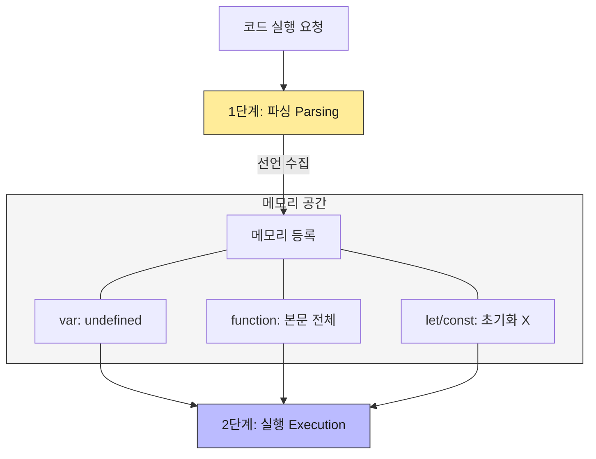

## 자바스크립트의 알쏭달쏭한 동작들

자바스크립트를 사용하다 보면 다른 언어와는 다른 독특한 동작들 때문에 당황할 때가 있다.
분명 변수를 선언하기 전에 사용했는데 에러가 안 나거나(`var`), 함수를 `function`으로 만들었을 때와 `=>`(화살표)로 만들었을 때 동작이 달라지는 경우가 그렇다.

오늘은 자바스크립트의 동작 원리를 이해하는 데 필수적인 <b>호이스팅(Hoisting)</b>과 <b>화살표 함수(Arrow Function)</b>의 차이점에 대해 깊이 파고들어 보자.

---

## 1. 호이스팅(Hoisting): 왜 위로 끌어올려질까?

### 1-1. 호이스팅의 정의
호이스팅이란 **변수와 함수의 선언문이 해당 스코프의 최상단으로 끌어올려지는 듯한 현상**을 말한다.
이 때문에 코드가 실행되기 전(초기화 전)에 변수나 함수에 접근할 수 있는 기이한(?) 일이 발생한다.

### 1-2. 동작 원리 (파싱과 실행의 분리)
흔히 자바스크립트를 인터프리터 언어(한 줄씩 읽고 실행)라고 알고 있지만, 실제 엔진은 실행 전에 **파싱(Parsing)** 단계를 거친다.



1.  **파싱 단계**: 엔진은 코드를 훑으며 선언된 변수와 함수를 메모리에 먼저 등록한다.
2.  **실행 단계**: 실제 코드를 한 줄씩 실행한다.

이때, 선언 방식에 따라 메모리에 등록되는 상태가 다르다.

| 구분 | 호이스팅 여부 | 초기화 상태 | 접근 가능 여부 |
| :--- | :--- | :--- | :--- |
| **var** | O | `undefined` | 가능 (값은 undefined) |
| **function** | O | 함수 본문 전체 | 가능 (호출 가능) |
| **let / const** | O | **초기화 안 됨** | **불가능 (ReferenceError)** |

### 1-3. TDZ (Temporal Dead Zone)
`let`과 `const`도 호이스팅은 되지만, <b>TDZ(일시적 사각지대)</b>에 갇혀 있어 선언 줄에 도달하기 전까지 접근하면 에러가 발생한다. 이는 개발자의 실수를 줄이고 코드의 예측 가능성을 높이기 위해(버그 방지) ES6에서 도입된 개념이다.

> **재밌는 사실**: 자바스크립트의 창시자 브렌던 아이크에 따르면, 호이스팅은 원래 의도된 기능이라기보단 초기 구현 과정에서 발생한 '실수(Bug)'에 가까웠다고 한다. 이를 바로잡은 것이 ES6의 `let`, `const`다.

---

## 2. 화살표 함수 vs 일반 함수 (`function`)

ES6에서 등장한 화살표 함수(`=>`)는 단순히 타이핑을 줄여주는 문법 설탕(Syntactic Sugar)이 아니다. 가장 큰 차이점은 **`this`를 다루는 방식**에 있다.

### 2-1. 문법적 차이와 Arguments
*   **코드 블록**: 한 줄짜리 함수는 중괄호`{}`와 `return`을 생략할 수 있다.
*   **Arguments 객체**: 일반 함수에는 `arguments`라는 유사 배열 객체가 존재하지만, 화살표 함수에는 없다. 대신 `...args`(Rest Parameters)를 사용해야 한다.

### 2-2. 핵심은 'this' 바인딩
가장 중요한 차이는 **`this`가 무엇을 가리키느냐**이다.

#### 일반 함수 (`function`) : Dynamic Binding
일반 함수의 `this`는 <b>함수가 "어떻게 호출되었는가"</b>에 따라 동적으로 변한다.
*   그냥 호출 → 전역 객체 (window)
*   객체의 메서드로 호출 → 해당 객체
*   이벤트 핸들러 → 이벤트 발생 요소

이러한 동적 바인딩은 코드를 예측하기 어렵게 만든다. (콜백 함수로 넘겼을 때 `this`가 바뀌는 문제 등)

#### 화살표 함수 (`=>`) : Lexical Binding
화살표 함수는 스스로의 `this`를 가지지 않는다. 대신 **상위 스코프(Lexical Scope)의 `this`를 그대로 물려받는다.**

```javascript
const obj = {
  value: 42,
  regular: function() {
    setTimeout(function() {
      console.log(this.value); // undefined (this가 전역 객체로 바뀜)
    }, 1000);
  },
  arrow: function() {
    setTimeout(() => {
      console.log(this.value); // 42 (상위 스코프 obj의 this를 유지)
    }, 1000);
  }
};
```

### 2-3. 언제 무엇을 써야 할까?
*   **화살표 함수**: `this`를 고정하고 싶을 때 (콜백 함수, 메서드 내부 함수 등)
*   **일반 함수**: `this`가 변해야 할 때 (객체의 메서드 정의, addEventListener 등)

---

<div class="flex items-center gap-2"><svg class="w-10 h-10 text-gray-800 dark:text-gray-200" fill="none" xmlns="http://www.w3.org/2000/svg" viewBox="0 0 24 24"><path d="M5 3H3v18h18V3H5zm0 2h14v14H5V5zm4 7H7v2h2v2h2v-2h2v-2h2v-2h2V8h-2v2h-2v2h-2v2H9v-2z" fill="currentColor"/></svg><span class="font-bold text-2xl">글 요약</span></div>

- **호이스팅**: JS 엔진이 코드를 실행하기 전 선언문을 메모리에 먼저 등록하는 과정이다. `var`는 `undefined`로 초기화되지만, `let/const`는 TDZ에 있어 접근 시 에러가 발생한다.
- **함수 호이스팅**: 함수 선언문(`function`)은 통째로 호이스팅되어 어디서든 호출 가능하지만, 함수 표현식은 변수 호이스팅 규칙을 따른다.
- **화살표 함수의 this**: 호출 방식에 따라 변하는 일반 함수와 달리, 화살표 함수는 <b>선언된 위치의 상위 스코프</b> `this`를 정적으로 가져온다(Lexical `this`).