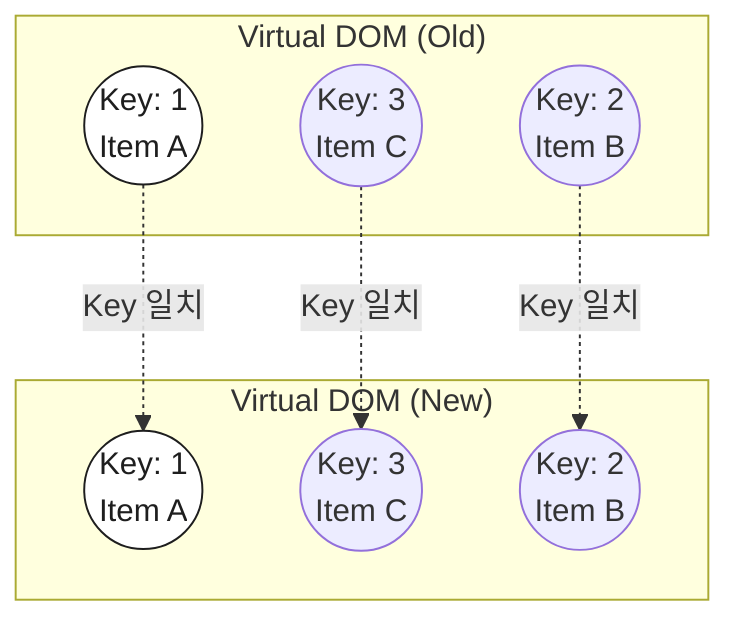
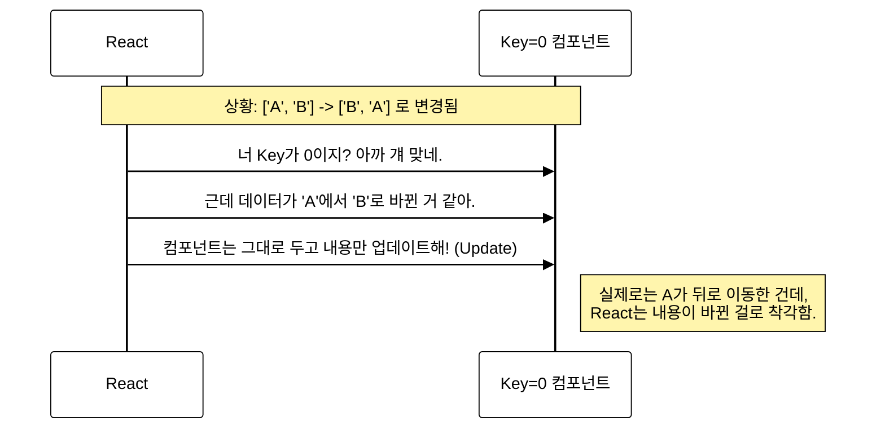

## React에서 Key란 무엇인가?
React로 개발을 하다 보면 배열을 `map()` 함수로 순회하여 화면에 그릴 때가 많다. 이때 `key` props를 넘겨주지 않으면 콘솔 창에 빨간색 경고 메시지가 뜨는 것을 본 적이 있을 것이다.

도대체 이 **Key**가 뭐길래 React는 이렇게 집착하는 것일까? 단순히 경고를 없애기 위해 넣는 것이 아니라, React의 성능과 동작 원리에 깊은 연관이 있다.

### 1. Key의 정의와 역할
**Key**는 리스트를 매핑하여 동일한 컴포넌트를 여러 개 렌더링할 때, <b>각 컴포넌트를 식별하는 고유한 값(Identity)</b>이다.

React는 상태가 변할 때마다 새로운 Virtual DOM을 생성하고, 이전 Virtual DOM과 비교하여 변경된 부분만 실제 DOM에 반영한다. 이 과정을 <b>재조정(Reconciliation)</b>이라고 한다.

이때 **Key**는 React가 어떤 항목이 변경, 추가, 또는 삭제되었는지 **빠르게 식별**할 수 있도록 돕는 이름표 역할을 한다.


위 그림처럼 순서가 뒤죽박죽 섞여도, React는 **Key**를 보고 "아, 2번 아이템이 저기로 이동했구나!"라고 정확히 파악하여 최소한의 리렌더링만 수행한다.

### 2. 배열의 Index를 Key로 쓰면 안 되는 이유
많은 초보 개발자들이 고유한 ID가 없을 때, `map`의 두 번째 인자인 `index`를 Key로 사용하곤 한다. 하지만 이는 **순서가 변할 수 있는 리스트**에서는 치명적인 문제를 야기할 수 있다.

#### 2-1. 문제 상황 시뮬레이션
`['A', 'B', 'C']`라는 배열이 있고, 이를 Index를 Key로 사용하여 렌더링했다고 가정하자.

1.  **초기 상태**:
    - Index 0: A
    - Index 1: B
    - Index 2: C
2.  **순서 변경 (역순 정렬)**: `['C', 'B', 'A']`
    - Index 0: C
    - Index 1: B
    - Index 2: A

React 입장에서 Key는 여전히 `0, 1, 2`로 동일하다.
- React: "어? Key 0번은 아까도 있었는데? **그럼 컴포넌트는 재사용하고 내용(Text)만 바꿔야지.**"

#### 2-2. 결과 (비효율과 버그)
React는 컴포넌트 자체가 이동했다고 판단하는 것이 아니라, **제자리에서 내용만 갈아끼우는 비효율적인 작업**을 수행하게 된다. 만약 컴포넌트 내부에 `<input>` 같은 상태(State)가 있었다면, 내용은 바뀌었는데 입력값은 그대로 남아있는 끔찍한 버그가 발생할 수 있다.



따라서 **순서가 변경되거나 요소가 추가/삭제될 가능성이 있는 리스트**에서는 절대 Index를 Key로 사용해서는 안 된다.

### 3. 고유한 Key가 없을 때 해결 방법
DB에서 가져온 데이터라면 보통 `id` 컬럼이 있겠지만, 그렇지 않은 경우엔 어떻게 해야 할까?

#### 3-1. Props 조합하기
데이터가 가진 속성 중 유니크한 조합을 찾아 Key로 만든다.
```jsx
// 예: 사용자 이름과 이메일은 중복되지 않는다고 가정
<li key={`${user.name}-${user.email}`}>
  {user.name}
</li>
```

#### 3-2. UUID 사용하기
정말 아무것도 없다면 `uuid` 같은 라이브러리를 사용하여 고유한 식별자를 생성할 수 있다.
단, UUID는 128비트 길이의 문자열이므로 **메모리를 많이 차지**한다는 단점이 있다. 또한, 렌더링할 때마다 UUID를 새로 생성하면 매번 Key가 바뀌어 리렌더링이 발생하므로, 데이터 생성 시점에 한 번만 만들어두는 것이 좋다.

---

<div class="flex items-center gap-2"><svg class="w-10 h-10 text-gray-800 dark:text-gray-200" fill="none" xmlns="http://www.w3.org/2000/svg" viewBox="0 0 24 24"><path d="M5 3H3v18h18V3H5zm0 2h14v14H5V5zm4 7H7v2h2v2h2v-2h2v-2h2v-2h2V8h-2v2h-2v2h-2v2H9v-2z" fill="currentColor"/></svg><span class="font-bold text-2xl">글 요약</span></div>

- **Key의 역할**: React가 변경된 항목(추가, 삭제, 이동)을 식별하여 효율적으로 **재조정(Reconciliation)** 하기 위한 고유 ID다.
- **Index 사용 금지**: 리스트의 순서가 바뀌면 Index도 바뀌지만 React는 Key가 같다고 인식하므로, **불필요한 리렌더링이나 상태 꼬임 버그**가 발생한다.
- **대체 방법**: DB의 ID를 쓰는 게 베스트이며, 없다면 `uuid`나 여러 데이터를 조합하여 **고유하고 변하지 않는 값**을 Key로 설정해야 한다.