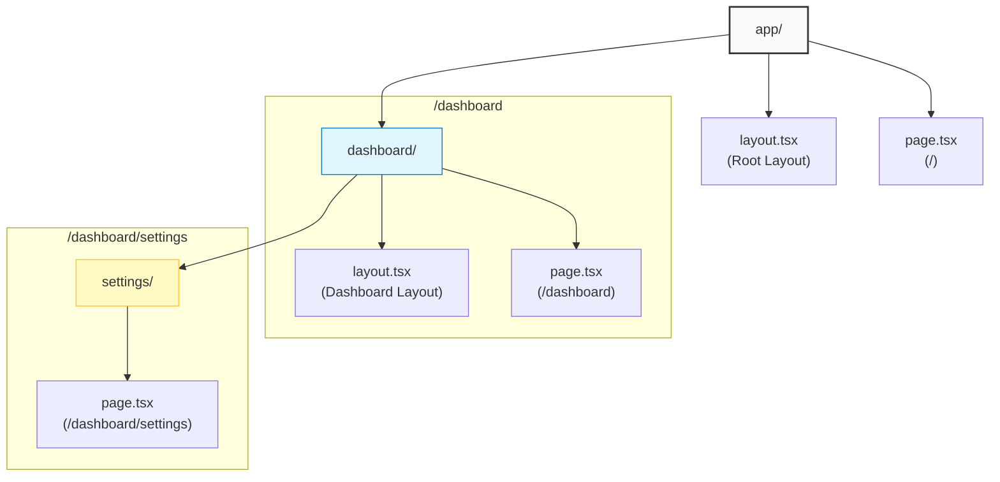
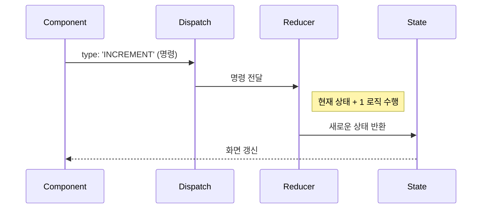

<!--  -->

## 서론: Next.js, 파일이 곧 경로다
Next.js App Router를 처음 접하면 가장 먼저 마주하는 것이 바로 <b>폴더 기반 라우팅(File-system based Routing)</b>이다. `react-router-dom`처럼 라우터를 별도로 설정할 필요 없이, 폴더를 만드는 것만으로 URL이 생성된다는 점이 매력적이다.

하지만 페이지 이동을 할 때 `<a>` 태그를 써야 할지, `<Link>`를 써야 할지, 아니면 `useRouter` 훅을 써야 할지 헷갈릴 때가 많다. 오늘 공부한 내용을 바탕으로 Next.js의 뼈대와 핵심 훅들을 정리해 봤다.

### 1. App Router의 폴더 구조
Next.js 13 이상(App Router)에서는 `app` 폴더가 모든 라우팅의 시작점이다. 핵심 규칙은 간단하다. <b>폴더는 경로(Path)이고, 파일은 UI다</b>.

#### 1-1. 기본 라우팅 규칙
- **폴더 이름** = URL 경로 (`/about`, `/dashboard` 등)
- **page.tsx** = 해당 경로에 접속했을 때 보여줄 페이지 UI
- **layout.tsx** = 해당 경로와 하위 경로들이 공유하는 레이아웃 (헤더, 사이드바 등)



위 그림처럼 `layout.tsx`는 중첩(Nesting)이 가능하다. `/dashboard/settings`에 접속하면 `Root Layout` > `Dashboard Layout` > `Settings Page` 순서로 UI가 합성되어 렌더링 된다.

### 2. 페이지 이동: Link vs useRouter
Next.js에서 페이지를 이동하는 방법은 크게 두 가지다. 상황에 따라 명확하게 구분해서 써야 한다.

#### 2-1. `<Link>` 컴포넌트 (추천)
HTML의 `<a>` 태그를 확장한 Next.js 전용 컴포넌트다.
*   **특징**: 뷰포트(화면)에 링크가 보이기만 해도 백그라운드에서 데이터를 미리 로드(**Prefetching**)한다.
*   **장점**: 클릭하는 순간 대기 시간 없이 즉시 페이지가 뜬다. SEO에도 유리하다.
*   **용도**: 네비게이션 메뉴, 리스트 아이템 등 **단순 클릭 이동** 시 무조건 사용.

```tsx
import Link from 'next/link';

<Link href="/dashboard">대시보드로 이동</Link>
```

#### 2-2. `useRouter` 훅
자바스크립트 코드로 페이지를 이동시켜야 할 때 사용한다.
*   **주의**: **Client Component** (`'use client'`)에서만 사용할 수 있다.
*   **용도**: 로그인 성공 후 이동, 폼 제출 후 이동 등 **로직 처리 후 이동**해야 할 때.

```tsx
'use client';
import { useRouter } from 'next/navigation';

export default function LoginBtn() {
  const router = useRouter();

  const handleLogin = async () => {
    const success = await login();
    if (success) {
      router.push('/dashboard'); // 로그인 성공 시 이동
    }
  };

  return <button onClick={handleLogin}>로그인</button>;
}
```

### 3. 상태 관리의 끝판왕: useReducer
`useState`만으로도 상태 관리는 충분하지만, 상태가 복잡해지면 컴포넌트 코드가 지저분해진다. 이때 등장하는 것이 `useReducer`다.

*   **핵심 개념**: 상태를 변경하는 <b>로직(Reducer)</b>을 컴포넌트 밖으로 분리한다.
*   **Dispatch**: 컴포넌트는 "값을 바꿔줘"라고 명령(`Action`)만 보낸다.



간단한 카운터나 토글은 `useState`가 좋지만, 쇼핑카트나 복잡한 폼 데이터처럼 **여러 상태가 얽혀있을 때**는 `useReducer`가 훨씬 깔끔하다.

---

<div class="flex items-center gap-2"><svg class="w-10 h-10 text-gray-800 dark:text-gray-200" fill="none" xmlns="http://www.w3.org/2000/svg" viewBox="0 0 24 24"><path d="M5 3H3v18h18V3H5zm0 2h14v14H5V5zm4 7H7v2h2v2h2v-2h2v-2h2v-2h2V8h-2v2h-2v2h-2v2H9v-2z" fill="currentColor"/></svg><span class="font-bold text-2xl">글 요약</span></div>

- **라우팅**: 폴더가 곧 URL이다. `page.tsx`는 화면을, `layout.tsx`는 공통 껍데기를 담당한다.
- **이동 (`Link` vs `useRouter`)**:
    - 일반적인 이동은 `<Link>` (속도, SEO 고려).
    - 로그인/로직 후 이동은 `useRouter` (클라이언트 컴포넌트 필수).
- **상태 관리**: 단순하면 `useState`, 로직이 복잡하고 상태가 많아지면 `useReducer`로 분리하자.